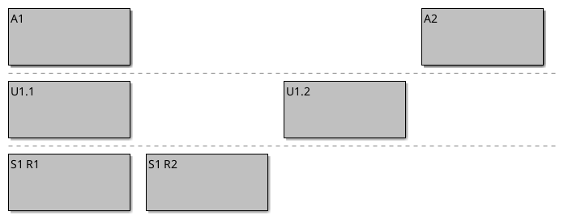
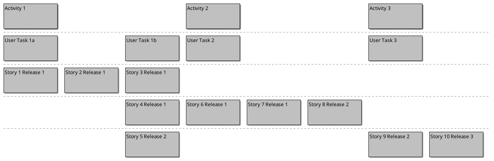

## User Story Board 

This diagram can represent User Story Maps as used in agile software development: Activity> User Task> Story, and their allocation into Sprints (see this tutorial on [User Story Mapping](https://www.aha.io/roadmapping/guide/release-management/what-is-user-story-mapping), a [Quick Reference](http://www.jpattonassociates.com/wp-content/uploads/2015/03/story_mapping.pdf), or the whole [Story Mapping](https://www.jpattonassociates.com/story-mapping/) site).

In the future it may support other agile terminology, eg Epic> Story> Task, and their allocation into Releases (FixVersions).

It is very rudimentary for now, and we hope to add:

- Colors
- Text wrapping in the boxes
- Labels in the left margin
- Links to detailed story descriptions

Please comment in [issue #423](https://github.com/plantuml/plantuml/issues/423) "Incubation of user story board"

## Desired Diagram

The target (desired) diagram looks something like this.

## Current Implementation

The current implementation looks like this.
The components of a board are made out as an indented list.

First a tiny board:

Now a more realistic board: 

