## Using dark mode

Style support the standard ``@media (prefers-color-scheme:dark)`` directive.

As you can see in  [the default CSS used by PlantUML](https://github.com/plantuml/plantuml/blob/master/skin/plantuml.skin).

```plantuml
@startuml
<style>
element {
  backgroundColor: #OrangeRed;
}

@media (prefers-color-scheme:dark) {
element {
  backgroundColor: #DarkGoldenRod;
}
}
</style>

Alice -> Bob
@enduml
```



The previous example with ``OrangeRed`` with [light mode](https://www.plantuml.com/plantuml/uml/VSwz2i8m5CNn_Jx51HSTYdijfNw0ez0tI9DZBKrovIOTH7ntKt2Minv-_BkKZUObU6fIVdcq18-0cFbDp8EnywYoH7SMBrhpvgOcZkZX3lGXwWBSP7ZxLDoXgRBhgqhsKOZQ6PrtXVaFNihhAjuXzhAYPSt-bq97FrbmrV991keGNGdz0W00) and ``DarkGoldenRod`` with [dark mode](https://www.plantuml.com/plantuml/duml/VSwz2i8m5CNn_Jx51HSTYdijfNw0ez0tI9DZBKrovIOTH7ntKt2Minv-_BkKZUObU6fIVdcq18-0cFbDp8EnywYoH7SMBrhpvgOcZkZX3lGXwWBSP7ZxLDoXgRBhgqhsKOZQ6PrtXVaFNihhAjuXzhAYPSt-bq97FrbmrV991keGNGdz0W00).


## Running in dark mode

* If you are using [the command line](command-line), you can add ``-darkmode`` flag to your command line to generate diagrams with dark-mode.
* If you are using [the public API](api), you have to specify the use of dark mode in ``FileFormatOption``. For example: 

```
String source = "@startuml\n";
source += "Bob -> Alice : hello\n";
source += "@enduml\n";

SourceStringReader reader = new SourceStringReader(source);
final ByteArrayOutputStream os = new ByteArrayOutputStream();
// Write the first image to "os"
String desc = reader.generateImage(os,
    new FileFormatOption(FileFormat.PNG).withColorMapper(ColorMapper.DARK_MODE));
os.close();
```


