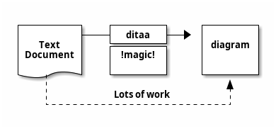
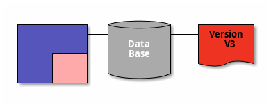
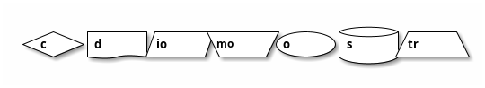

# Ditaa

[Ditaa *(DIagrams Through Ascii Art)*](http://ditaa.sourceforge.net) is an Open Source project that allows to generate general diagrams from a text descriptions. The idea is close to **PlantUML**, and it may be useful for documentation to generate other diagrams than UML.

Then **PlantUML** allows this :

> It is now not possible to use [Ditaa](http://ditaa.sourceforge.net) with ``@startuml`` by using ``ditaa`` keyword on the very first line of your description.
> You must now use ``@startditaa`` and ``@endditaa``.

⚠ On PlantUML, only **PNG** generation is supported.

## Generalisation (of @start/@end tag)

**PlantUML** now can generate diagrams other than UML. In such cases the usual ``@startuml`` does not make sense anymore. So now we allow diagrams start with ``@startXYZ`` and finish with ``@endXYZ``, where ``XYZ`` can change with the type of diagram and can be any characters (including spaces).

> This means that plugin developers are encouraged to change their code to recognize ``@start`` instead of ``@startuml``.

DITAA diagrams are usually formatted as ``@startditaa...@endditaa``.

## Option supported by PlantUML

You can also use some option, after the ``@startditaa`` or ``ditaa`` keyword:

* ``-E`` or ``--no-separation`` to remove separator
* ``-S`` or ``--no-shadows`` to remove shadow
* ``scale=<XYZ>`` to scale up or down the diagram

### Without option

### Remove separator

### Remove shadow or scale diagram

```plantuml
@startditaa < --no-shadows, scale=0.7
+---------+  /--------\   +-------+
| cBLU    +--+cAAA    +---+Version|
|         |  |  Data  |   |   V3  |
|    +----+  |  Base  |   |cRED{d}|
|    |cPNK|  |     {s}|   +-------+
|    |    |  \---+----/
+----+----+    
@endditaa
```

## Tags

| Tag  | Description 
| ---- | ------------
| {c}  | Choice or Decision
| {d}  | Document - Symbol representing a document
| {io} | Input/Output - Symbol representing input/output  
| {mo} | Manual operation                                          
| {o}  | Ellipse                                                   
| {s}  | Storage - Symbol representing a form of storage, like a database or a hard disk.
| {tr} | Trapezoid   

## More documentation

You will find the complete documentation about **ditaa** on:
* [ditaa.sourceforge.net](http://ditaa.sourceforge.net)
* [github.com/stathissideris/ditaa](https://github.com/stathissideris/ditaa)

