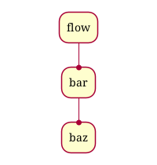

## Flow diagram

You can use PlantUML to generate a simple Flow diagram.

To activate this feature, the diagram must:
* begin with ``@startflow`` keyword
* end with ``@endflow`` keyword. 

*[Ref. [QA-13557](https://forum.plantuml.net/13557/support-for-the-different-%40start-commands), [GH-501](https://github.com/plantuml/plantuml/issues/501#issuecomment-805783661)]*

