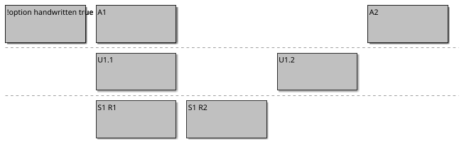
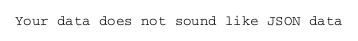
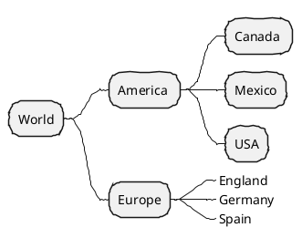
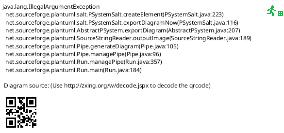
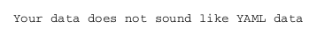

## Handwritten diagram style

To emphasize the fact that your diagrams are still under work, you can generate handwritten diagrams.

To do so, you have to set:
- ``handwritten`` skinparam to ``true`` _(for version before V1.2025.1)_
- ``handwritten`` option to ``true`` _(since V1.2025.1)_


## Activity
```plantuml
@startuml
!option handwritten true
start
if (Graphviz installed?) then (yes)
  :process all\ndiagrams;
else (no)
  :process only
  __sequence__ and __activity__ diagrams;
endif
stop
@enduml
```


## Board



## Class
```plantuml
@startuml
!option handwritten true
class Object
class String extends Object
class Date extends Object
@enduml
```


## Deployment 
### Deployment shapes

```plantuml
@startuml
!option handwritten true
actor actor
actor/ "actor/"
agent agent
artifact artifact
boundary boundary
card card
circle circle
cloud cloud
collections collections
component component
control control
database database
entity entity
file file
folder folder
frame frame
hexagon hexagon
interface interface
label label
node node
package package
person person
queue queue
rectangle rectangle
stack stack
storage storage
usecase usecase
usecase/ "usecase/"
@enduml
```

### Deployment with Group

```plantuml
@startuml
!option handwritten true
package "Some Group" {
  HTTP - [First Component]
  [Another Component]
}

node "Other Groups" {
  FTP - [Second Component]
  [First Component] --> FTP
}

cloud {
  [Example 1]
}

database "MySql" {
  folder "This is my folder" {
    [Folder 3]
  }
  frame "Foo" {
    [Frame 4]
  }
}

[Another Component] --> [Example 1]
[Example 1] --> [Folder 3]
[Folder 3] --> [Frame 4]

@enduml
```


## EBNF

```plantuml
@startebnf
!option handwritten true

title Title
not_styled_ebnf = {"a", c , "a" (* Note on a *)}
| ? special ?
| "repetition", 4 * '2';
(* Global End Note *)
@endebnf
```


## Gantt
```plantuml
@startgantt
!option handwritten true 
hide footbox
Project starts the 2020-12-01

[Task1] lasts 9 days
sunday are closed

note bottom
  memo1 ...
  memo2 ...
  explanations1 ...
  explanations2 ...
end note

[Task2] lasts 10 days
[Task2] starts 7 days after [Task1]'s end
note bottom
  memo1 ...
  memo2 ...
  explanations1 ...
  explanations2 ...
end note
-- Separator title --
[M1] happens on 5 days after [Task1]'s end

-- end --
@endgantt
```


## JSON




## MindMap



## Network
```plantuml
@startuml
!option handwritten true

nwdiag {
  network dmz {
      address = "210.x.x.x/24"

      web01 [address = "210.x.x.1"];
      web02 [address = "210.x.x.2"];
  }
  network internal {
      address = "172.x.x.x/24";

      web01 [address = "172.x.x.1"];
      web02 [address = "172.x.x.2"];
      db01;
      db02;
  }
}
@enduml
```


## Object
```plantuml
@startuml
!option handwritten true

object user1
user1 : name = "Dummy"
user1 : id = 123

object user2 {
  name = "Dummy"
  id = 123
}

object o1
object o2
diamond dia
object o3

o1  --> dia
o2  "1" -> "1" dia
dia --> o3

object London

map CapitalCity {
 UK *-> London
 USA => Washington
 Germany => Berlin
}

note right of London: Big ben
user1 --> CapitalCity : visits >
@enduml
```


## Salt



## Sequence
```plantuml
@startuml
!option handwritten true
Alice -> Bob : hello
note right: Not validated yet
@enduml
```


## State
```plantuml
@startuml
!option handwritten true
state choice1 <<choice>>
state fork1   <<fork>>
state join2   <<join>>
state end3    <<end>>

[*]     --> choice1 : from start\nto choice
choice1 --> fork1   : from choice\nto fork
choice1 --> join2   : from choice\nto join
choice1 --> end3    : from choice\nto end

fork1   ---> State1 : from fork\nto state
fork1   --> State2  : from fork\nto state

State2  --> join2   : from state\nto join
State1  --> [*]     : from state\nto end

join2   --> [*]     : from join\nto end
@enduml
```


## Timing
```plantuml
@startuml
!option handwritten true
robust "Web Browser" as WB
concise "Web User" as WU

WB is Initializing
WU is Absent

@WB
0 is idle
+200 is Processing
+100 is Waiting
WB@0 <-> @50 : {50 ms lag}

@WU
0 is Waiting
+500 is ok
@200 <-> @+150 : {150 ms}
@enduml
```


## WBS
```plantuml
@startwbs
!option handwritten true
* World
** America 
*** Canada 
*** Mexico
*** USA
** Europe
***_  England
***_  Germany
***_  Spain
@endwbs
```


## Wire
```plantuml
@startwire
!option handwritten true
* first
* second_box [100x50]
* third
@endwire
```


## YAML




