## Display HCL Data

---
🚧 - _Under construction_

🆕 functionality still in testing stage...
These new features are still under construction 🚧

🚧 - _Under construction_
---

You can use PlantUML to visualize your [HCL Configuration Languages](https://hcl.readthedocs.io/en/latest/index.html).

To activate this feature, the diagram must:
* begin with ``@starthcl`` keyword
* end with ``@endhcl`` keyword. 

```plantuml
@starthcl
{
key = "value"
}
@endhcl
```

Ref.:
- [GH@hashicorp/hcl](https://github.com/hashicorp/hcl)
- [HCL Configuration Languages](https://hcl.readthedocs.io/en/latest/index.html).
- [HCL on GH@plantuml/plantuml](https://github.com/plantuml/plantuml/search?q=HCL)
- [QA-17357](https://forum.plantuml.net/17357/documentation-of-hcl-and-regex)

## The example taken from the hcl website.

```plantuml
@starthcl
{
  "io_mode": "async",
  "service": {
    "http": {
      "web_proxy": {
        "listen_addr": "127.0.0.1:8080",
        "process": {
          "main": {
            "command": ["/usr/local/bin/awesome-app", "server"]
          },
          "mgmt": {
            "command": ["/usr/local/bin/awesome-app", "mgmt"]
          },
        }
      }
    }
  }
}
@endhcl
```

