## MindMap

A **MindMap diagram**, in the context of **PlantUML**, is an effective tool for **brainstorming**, organizing ideas, and project planning. MindMap diagrams, or mind maps, are **visual representations** of information, where central ideas branch out into related topics, creating a spider-web of concepts. PlantUML facilitates the creation of these diagrams with its simple, **text-based syntax**, allowing for the efficient organization and visualization of complex ideas.

Using PlantUML for MindMaps is particularly advantageous due to its **integration with other tools** and systems. This integration streamlines the process of incorporating mind maps into larger project documentation. PlantUML's text-based approach also enables easy modification and **version control** of the mind maps, making it a dynamic tool for collaborative brainstorming and idea development.

MindMaps in PlantUML can be used for various purposes, from outlining the structure of a project to brainstorming product features or business strategies. The **hierarchical and intuitive layout** of mind maps helps in identifying relationships between different ideas and concepts, making it easier to see the bigger picture and to pinpoint areas that require further exploration. This makes PlantUML an invaluable tool for project managers, developers, and business analysts who require a method to visually organize and present complex information in a clear and concise manner.


## OrgMode syntax

This syntax is compatible with OrgMode

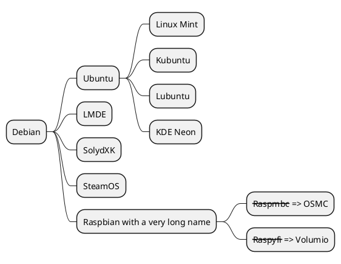


## Markdown syntax

This syntax is compatible with Markdown

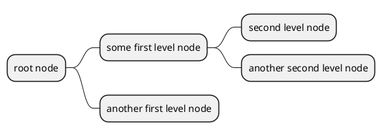


## Arithmetic notation

You can use the following notation to choose diagram side.

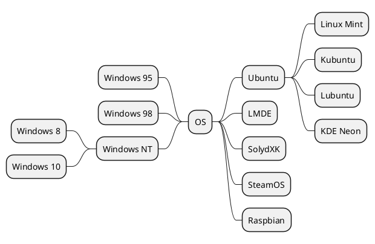


## Multilines

You can use ``:`` and ``;`` to have multilines box.

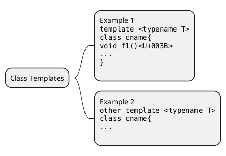

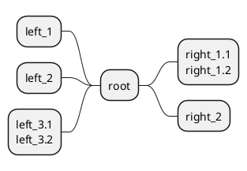


## Multiroot Mindmap

You can create multiroot mindmap, as:

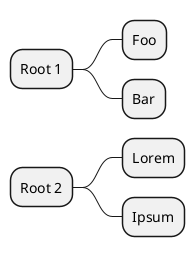

*[Ref. [QH-773](https://github.com/plantuml/plantuml/issues/773)]*


## Colors

It is possible to change node [color](color).

### With inline color

* OrgMode syntax mindmap
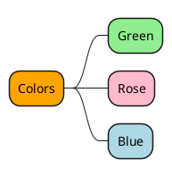

* Arithmetic notation syntax mindmap
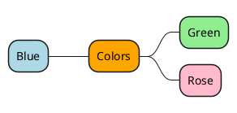

* Markdown syntax mindmap
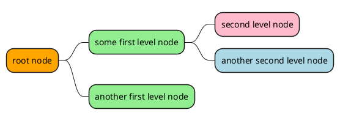

### With style color

* OrgMode syntax mindmap
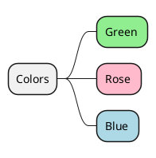

* Arithmetic notation syntax mindmap
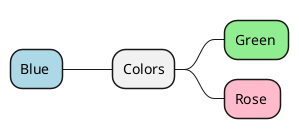

* Markdown syntax mindmap
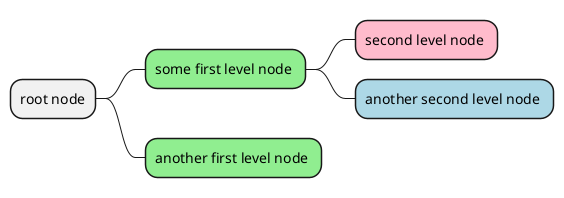

* Apply style to a branch

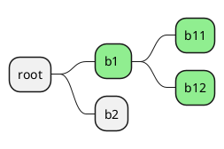

*[Ref. [GA-920](https://github.com/plantuml/plantuml/issues/920)]*


## Removing box

You can remove the box drawing using an underscore.

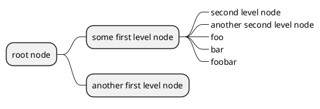
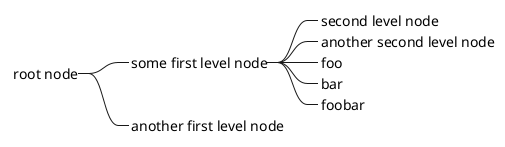

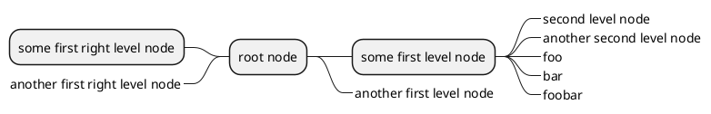


## Changing diagram direction

It is possible to use both sides of the diagram.

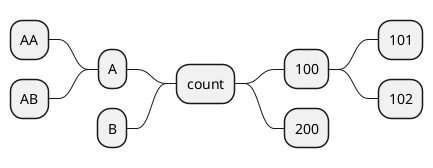


## Change (whole) diagram orientation

You can change (whole) diagram orientation with: 
- `left to right direction` _(by default)_
- `top to bottom direction`
- `right to left direction`
- `bottom to top direction` _(not yet implemented/issue then use workaround)_

### Left to right direction _(by default)_

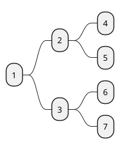

### Top to bottom direction

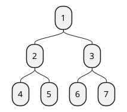

### Right to left direction

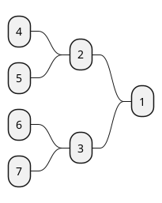

### Bottom to top direction

```plantuml
@startmindmap
top to bottom direction
left side
* 1
** 2
*** 4
*** 5
** 3
*** 6
*** 7
@endmindmap
```

*[Ref. [QH-1413](https://github.com/plantuml/plantuml/issues/1413)]*


## Complete example

```plantuml
@startmindmap
caption figure 1
title My super title

* <&flag>Debian
** <&globe>Ubuntu
*** Linux Mint
*** Kubuntu
*** Lubuntu
*** KDE Neon
** <&graph>LMDE
** <&pulse>SolydXK
** <&people>SteamOS
** <&star>Raspbian with a very long name
*** <s>Raspmbc</s> => OSMC
*** <s>Raspyfi</s> => Volumio

header
My super header
endheader

center footer My super footer

legend right
  Short
  legend
endlegend
@endmindmap
```


## Changing style

### node, depth
```plantuml
@startmindmap
<style>
mindmapDiagram {
    node {
        BackgroundColor lightGreen
    }
    :depth(1) {
      BackGroundColor white
    }
}
</style>
* Linux
** NixOS
** Debian
*** Ubuntu
**** Linux Mint
**** Kubuntu
**** Lubuntu
**** KDE Neon
@endmindmap
```

### boxless
```plantuml
@startmindmap
<style>
mindmapDiagram {
  node {
    BackgroundColor lightGreen
  }
  boxless {
    FontColor darkgreen
  }
}
</style>
* Linux
** NixOS
** Debian
***_ Ubuntu
**** Linux Mint
**** Kubuntu
**** Lubuntu
**** KDE Neon
@endmindmap
```


## Word Wrap

Using ``MaximumWidth`` setting you can control automatic word wrap. Unit used is pixel.

```plantuml
@startmindmap


<style>
node {
    Padding 12
    Margin 3
    HorizontalAlignment center
    LineColor blue
    LineThickness 3.0
    BackgroundColor gold
    RoundCorner 40
    MaximumWidth 100
}

rootNode {
    LineStyle 8.0;3.0
    LineColor red
    BackgroundColor white
    LineThickness 1.0
    RoundCorner 0
    Shadowing 0.0
}

leafNode {
    LineColor gold
    RoundCorner 0
    Padding 3
}

arrow {
    LineStyle 4
    LineThickness 0.5
    LineColor green
}
</style>

* Hi =)
** sometimes i have node in wich i want to write a long text
*** this results in really huge diagram
**** of course, i can explicit split with a\nnew line
**** but it could be cool if PlantUML was able to split long lines, maybe with an option 

@endmindmap
```


## Creole on Mindmap diagram

You can use [Creole or HTML Creole](creole) on Mindmap:

```plantuml
@startmindmap
* Creole on Mindmap
left side
**:==Creole
  This is **bold**
  This is //italics//
  This is ""monospaced""
  This is --stricken-out--
  This is __underlined__
  This is ~~wave-underlined~~
--test Unicode and icons--
  This is <U+221E> long
  This is a <&code> icon
  Use image : 
;
**: <b>HTML Creole 
  This is <b>bold</b>
  This is <i>italics</i>
  This is <font:monospaced>monospaced</font>
  This is <s>stroked</s>
  This is <u>underlined</u>
  This is <w>waved</w>
  This is <s:green>stroked</s>
  This is <u:red>underlined</u>
  This is <w:#0000FF>waved</w>
-- other examples --
  This is <color:blue>Blue</color>
  This is <back:orange>Orange background</back>
  This is <size:20>big</size>
;
right side
**:==Creole line
You can have horizontal line
----
Or double line
====
Or strong line
____
Or dotted line
..My title..
Or dotted title
//and title... //
==Title==
Or double-line title
--Another title--
Or single-line title
Enjoy!;
**:==Creole list item
**test list 1**
* Bullet list
* Second item
** Sub item
*** Sub sub item
* Third item
----
**test list 2**
# Numbered list
# Second item
## Sub item
## Another sub item
# Third item
;
@endmindmap

```

*[Ref. [QA-17838](https://forum.plantuml.net/17838/is-it-possible-to-add-custom-images-in-mindmap)]*


