## Nassi–Shneiderman diagram [nassi]

## Nassi–Shneiderman diagram

You can use PlantUML to visualize [Nassi–Shneiderman diagram](https://en.wikipedia.org/wiki/Nassi%E2%80%93Shneiderman_diagram) .

To activate this feature, the diagram must:
* begin with ``@startnassi`` keyword
* end with ``@endyaml`` keyword. 

```plantuml
@startyaml
title "Auto Insurance Application Process"
block "Auto Insurance Application Received"
if "# of at fault Accidents > 4" then
  block "Approved = false"
else
  if "# of at fault Accidents <= 1" then
    block "Approved = true"
  else
    block "Approved = true"
    block "Review each Accident"
    if "# DUI or Fatality" then
      block "Approved = false"
      break "Exit process"
    else
      block "Review Next"
    endif
  endif
endif
block "End"
@endnassi 
```

