## Notes

Here are some examples of notes on diagrams.


## Appendice: Examples of "Note on link" on all diagrams

### Activity
N/A

### Class
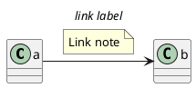

### Component, Deployment
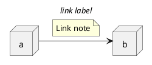

### Gantt project planning

N/A


### Object
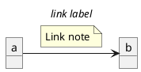

### MindMap

N/A

### Network (nwdiag)

N/A


### Sequence

N/A 

### State
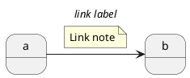

### Use-Case
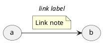


## Appendice: Examples of "Note [top|right|bottom|left] on link" on all diagrams

### Activity
N/A

### Class
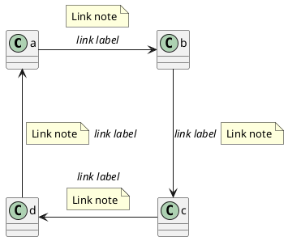

### Component, Deployment
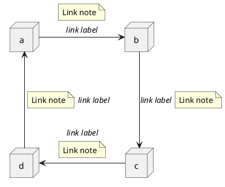

### Gantt project planning

N/A


### Object
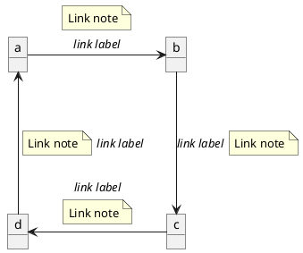

### MindMap

N/A

### Network (nwdiag)

N/A


### Sequence

N/A 

### State
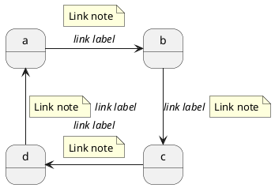

### Use-Case
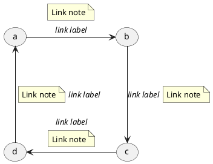


## Appendice: Examples of "Note [top|right|bottom|left] of link" on all diagrams

Test of the new feature "Note [top|right|bottom|left] **of** link"  (from v1.2020.20):

* OK for Component, Deployment, Use-case
* KO for Class, Objet, State

[[#FFD700#FIXME]] 
🚩
FIXME for Class, Objet, State
[[#FFD700#FIXME]] 

### Activity
N/A

### Class
```plantuml
@startuml
class a

a -> b: //link label//
note top of link
  Link note
end note
b ---> c: //link label//
note right of link
  Link note
end note
d <- c: //link label//
note bottom of link
  Link note
end note
a <--- d: //link label//
note left of link
  Link note
end note
@enduml
```

[[#FFD700#FIXME]] 
🚩
FIXME for Class
[[#FFD700#FIXME]] 


### Component, Deployment


### Gantt project planning

N/A


### Object
```plantuml
@startuml
object a
object b
object c
object d

a -> b: //link label//
note top of link
  Link note
end note
b ---> c: //link label//
note right of link
  Link note
end note
d <- c: //link label//
note bottom of link
  Link note
end note
a <--- d: //link label//
note left of link
  Link note
end note
@enduml
```

[[#FFD700#FIXME]] 
🚩
FIXME for Objet
[[#FFD700#FIXME]] 

### MindMap

N/A

### Network (nwdiag)

N/A


### Sequence

N/A 

### State
```plantuml
@startuml
state a
state b
state c
state d

a -> b: //link label//
note top of link
  Link note
end note
b -down-> c: //link label//
note right of link
  Link note
end note
c -left-> d: //link label//
note bottom of link
  Link note
end note
d -up-> a: //link label//
note left of link
  Link note
end note
@enduml
```

[[#FFD700#FIXME]] 
🚩
FIXME for State
[[#FFD700#FIXME]] 

### Use-Case


## Appendice: Examples of "Style" by stereotype on "Note" on all diagrams

### Activity
```plantuml
@startuml
<style>
.s2n {
    backgroundcolor green
    Linecolor red
    LineThickness 2
}
</style>

:a;
floating note left <<s2n>>: This is a note
:b;
note right <<s2n>>
  This note is on several
  //lines// and can
  contain <b>HTML</b>
end note

@enduml
```

### Class
```plantuml
@startuml
<style>
.s2n {
    backgroundcolor green
    Linecolor red
    LineThickness 2
}
</style>
class a

a -> b: //link label//
note left of a <<s2n>>
  Link note
end note
@enduml
```

### Component, Deployment
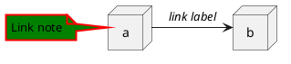

### Gantt project planning
```plantuml
@startgantt
<style>
.s2n {
    backgroundcolor green
    Linecolor red
    LineThickness 2
}
</style>

[task01] requires 15 days
note bottom <<s2n>>
  memo1 ...
  memo2 ...
  explanations1 ...
  explanations2 ...
end note

[task01] -> [task02]
@endgantt
```


### Object
```plantuml
@startuml
<style>
.s2n {
    backgroundcolor green
    Linecolor red
    LineThickness 2
}
</style>
object a
object b

a -> b: //link label//
note left of a <<s2n>>
  Link note
end note
@enduml
```

### MindMap

N/A

### Network (nwdiag)

N/A


### Sequence
```plantuml
@startuml
<style>
.s2n {
    backgroundcolor green
    Linecolor red
    LineThickness 2
}
</style>

note left of a: this is a note
note over a <<s2n>>: this is a note
note left of a<<s2n>>: other note
a -> b : txt


note left <<s2n>>
a note
can be defined
on several lines
end note
note right <<s2n>>: this is a first note
@enduml
```

### State
```plantuml
@startuml
<style>
.s2n {
    backgroundcolor green
    Linecolor red
    LineThickness 2
}
</style>
state a
state b

a -> b: //link label//
note left of a <<s2n>>
  Link note
end note
@enduml
```


### Timing
```plantuml
@startuml
<style>
.s2n {
    backgroundcolor green
    Linecolor red
    LineThickness 2
}
</style>

concise "Web User" as A

@0
A is Idle

@100
A is Waiting
note top of A <<s2n>>: first note\non several\nlines
note bottom of A <<s2n>>: second note\non several\nlines

@300
@enduml
```

### Use-Case
```plantuml
@startuml
<style>
.s2n {
    backgroundcolor green
    Linecolor red
    LineThickness 2
}
</style>
(a)
(b)

a -> b: //link label//
note left of a <<s2n>>
  Link note
end note
@enduml
```


