## Network diagram issues (nwdiag-issues)

This page lists issues on [nwdiag](nwdiag).


## Example *OK* on group of Peer networks [fixed on V1.2023.3beta4] [[#89FB89#FIXED]]

### Group on first
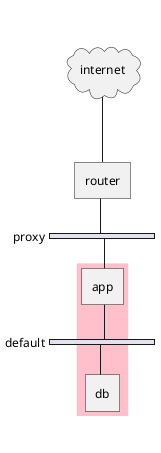

### Group on second


### Group on third


*[Ref. [Issue#408](https://github.com/plantuml/plantuml/issues/408) and [QA-12655](https://forum.plantuml.net/12655/nwdiag-overlapp-problem-with-3-newtorks?show=12661#c12661)]*


## Example *KO* with shape

1. Overlap of label for folder
1. Hexagon shape is missing

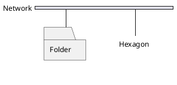

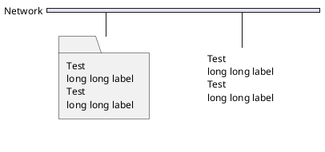


## Borderline cases of nwdiag (test of number lines)

### Element or Server

* How many adress lines before overlap? *[Hints: 7 (tested on V1.2021.8)]*

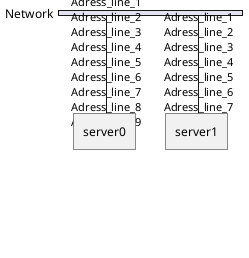


### Network

* How many adress lines before overlap? *[Hints: 7 or 16]*

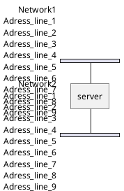
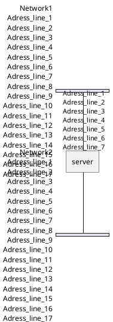


## Example *OK* with incoming server (e.g. the Internet or Web) [fixed on V1.2023.3beta4] [[#89FB89#FIXED]]

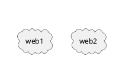

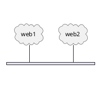

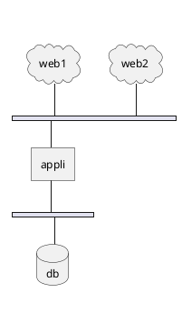

- Q?: What is the line on the top of web2 ?  [fixed on V1.2023.3beta4]


## Minimal *OK* example... [fixed on V1.2023.3beta4] [[#89FB89#FIXED]]

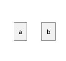

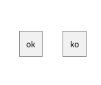

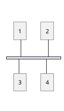

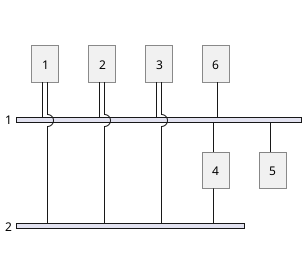


## Other internal networks (stretched) examples [[#89FB89#FIXED]] on V1.2023.9

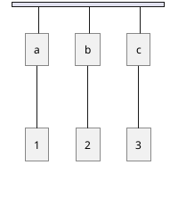

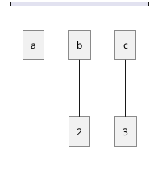


## Example *KO* on of Peer networks


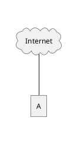

VS

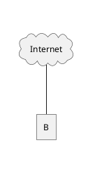


## OK: Example with 3 or more groups [[#89FB89#FIXED]]
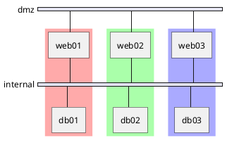
*[Ref. [QA-13138](https://forum.plantuml.net/13138)]*

```plantuml
@startuml
nwdiag {
  group {
    color = "#FFaaaa";
    web01;
    db01;
  }
  group {
    color = "#aaFFaa";
    web02;
    db02;
  }
  group {
    color = "#aaaaFF";
    web03;
    db03;
  }
  group {
    color = "#aaFFFF";
    web04;
    db04;
  }

  network dmz {
      web01;
      web02;
      web03;
      web04;
  }
  network internal {
      web01;
      db01 ;
      web02;
      db02 ;
      web03;
      db03;
      web04;
      db04;
  }
}
@enduml
```

▶ Seems to be corrected on V1.2021.10beta4-5+ *(but only on **opposite layout**)*


## Example *OK* on Goup of Peer networks between networks [fixed on V1.2023.3beta4] [[#89FB89#FIXED]]
 
### Group first: OK
```plantuml
@startuml
nwdiag {
  group group02 {
    color = palegreen
    a02;
    a01;
  }
  network net01 {
    a01;
  }
  a01 -- a02;
  network net02 {
    a02;
  }
}
@enduml
```

### Group at the end: OK (1.2023.3beta4)
```plantuml
@startuml
nwdiag {
  network net01 {
    a01;
  }
  a01 -- a02;
  network net02 {
    a02;
  }
  group group02 {
    color = pink
    a02;
    a01;
  }
}
@enduml
```


## Test of Peer networks

### No link
```plantuml
@startuml
nwdiag {
c1 [ shape = cloud];
c2 [ shape = cloud];
network nw {
  a;
  b;
}
}
@enduml
```

### On up
```plantuml
@startuml
nwdiag {
c1 [ shape = cloud];
c2 [ shape = cloud];
c1 -- a;
c2 -- b;
network nw {
  a;
  b;
}
}
@enduml
```

### On down
```plantuml
@startuml
nwdiag {
network nw {
  a;
  b;
}
c1 [ shape = cloud];
c2 [ shape = cloud];
a -- c1;
b -- c2;
}
@enduml
```

### Up/Down
```plantuml
@startuml
nwdiag {
c1 [ shape = cloud];
c2 [ shape = cloud];
c1 -- a;
network nw {
  a;
  b;
}
b -- c2;
}
@enduml
```


### KO but perhaps not realistic [[#C90000#KO]]
```plantuml
@startuml
nwdiag {
network nw {
  a;
  b;
}
c1 [ shape = cloud];
c2 [ shape = cloud];
c1 -- a;
c2 -- b;
}
@enduml
```

### KO but perhaps not realistic [[#C90000#KO]]
```plantuml
@startuml
nwdiag {
c1 [ shape = cloud];
c2 [ shape = cloud];
c1 -- a;
network nw {
  a;
  b;
}
c2 -- b;
}
@enduml
```

### KO (2 nw) but perhaps not realistic [[#C90000#KO]]
```plantuml
@startuml
nwdiag {
c1 [ shape = cloud];
c2 [ shape = cloud];
c1 -- a;
network nw {
  a;
  b;
}
b -- c2;
network nx {
b
}
}
@enduml
```


### KO : how to manage multiple peers [[#C90000#KO]]
```plantuml
@startuml
nwdiag {
c1 [ shape = cloud];
c1 -- a;
c1 -- b;
}
@enduml
```

### Up
```plantuml
@startuml
nwdiag {
c1 [ shape = cloud];
network nw {
  c1;
  a;
  b;
}
}
@enduml
```

### Down
```plantuml
@startuml
nwdiag {
network nw {
  c1;
  a;
  b;
}
c1 [ shape = cloud];
}
@enduml
```


### Other remarks ("What about...") [[#C90000#KO]]
```plantuml
@startuml
nwdiag {
c1 [ shape = cloud];
c2 [ shape = cloud];
c1 -- a;
c2 -- b;
network nw {
  a;
  b;
}
}
@enduml
```
```plantuml
@startuml
nwdiag {
c1 [ shape = cloud];
c2 [ shape = cloud];
c1 -- a;
b -- c2;
network nw {
  a;
  b;
}
}
@enduml
```

*[Ref. [QA-17932](https://forum.plantuml.net/17932/nwdiag-possible-misbehavior)]*


