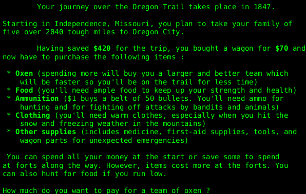
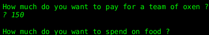
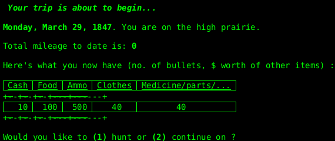
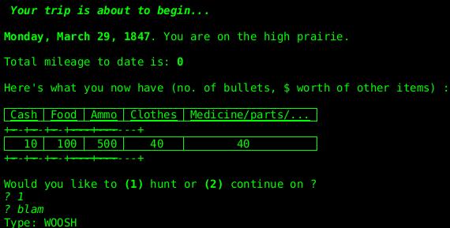

## The Oregon Trail

The [Oregon Trail](https://en.wikipedia.org/wiki/The_Oregon_Trail_%28series%29) is a *very old* game created
in 1971.

A version from [David Ahl](http://www.atariarchives.org/bca) (named as
[Westward Ho!](http://www.atariarchives.org/bca/Chapter02_WestwardHo.php) for some reasons)
has been ported to Java and integrated in **PlantUML**...

This page is dedicated to:
* Dan Rawitsch
* Bill Heinemann
* Paul Dillenberger
* David Ahl

## Let's play

To launch the game, you will have to use the good old ``RUN`` Basic command :

Every input has to be added in the text file:

Every input has to be added in the text file:

For shooting, you will have to type **as fast as possible**
the word printed on the screen (*like in the original version!*).

Good luck to you on the *Oregon Trail* !

