## Preprocessing JSON

Some *JSON preprocessing* capabilities are included in PlantUML, and available for all diagrams. 

That extends the current [preprocessing](preprocessing).

🛈 *If you are looking for how to display JSON data: see rather [Display JSON Data](json).*


## Variable definition

In addition to existing type (*String* and *Integer*), you can define JSON variable.

### JSON Object

Example:

```
!$foo = { "name": "John", "age" : 30 }
```

Corresponding of this structure:

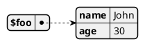

### JSON Array

Example:

```
!$foo = ["abc", "def", "ghi"]
```

Corresponding of this structure:

```plantuml
@startjson
["abc", "def", "ghi"]
@endjson
```


## Access to data

Once a variable is defined, you can access to its members:

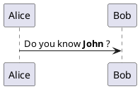

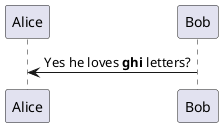


## Complex structures

It is possible to use complex JSON objects and arrays, with definition on several lines.

Let ``$foo``, the structure:
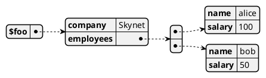


You can acess to the values:
* ``$foo.employees[0].name``
* ``$foo.employees[0].salary``


```plantuml
@startuml
!$foo = { "company": "Skynet", "employees" : [
  {"name" : "alice", "salary": 100 },
  {"name" : "bob", "salary": 50} ]
}

!$attribute_1="name"
!$attribute_2="salary"

start
:The salary of <u>$foo.employees[0][$attribute_1]</u> is <u>$foo.employees[0][$attribute_2]</u>;
@enduml
```


Or using intermediate variables:
* ``!$attribute_1="name"``
* ``!$attribute_2="salary"``
to acess to the values:
* ``$foo.employees[0][$attribute_1]``
* ``$foo.employees[0][$attribute_2]``


## Loading data

Some standard function provides a way to load JSON object from URL or local files:

```
!$foo = %load_json("http://foo.net/users/list.json")
!$foo2 = %load_json("myDir/localFile.json")
```

*Available since 1.2021.15*


## Loop [foreach]

If you define array, you can loop over.

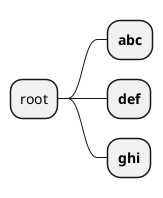

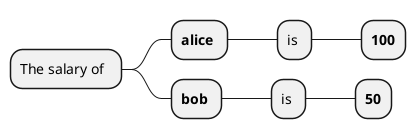

> [SW] Some remarks
> * for or better foreach ? -> `foreach`
> * It would be nice to also have "break" and "continue"
> * It would be nice to also have the for or while loop with a standard variable


## Full Example

From a example worked in a forum question, with this JSON structure:
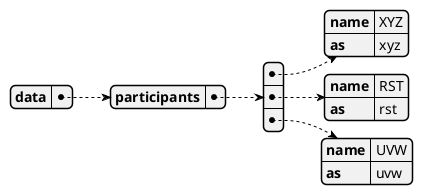

```plantuml
@startuml
!unquoted function DRAW($x) return %set_variable_value($x, 1)

!procedure addComponent($part, $component, $as)
    !if %variable_exists($part)
        participant "$component" as $as
    !endif
!end procedure 

!procedure addBox2($part, $box, $colour, $data)
    !if %variable_exists($part)
        box "$box" #$colour
            !foreach $item in $data.participants
                addComponent($part, $item.name, $item.as)
            !endfor
        end box
    !endif
!end procedure 

DRAW(PART25)

!ifdef PART25
title  TESTING  (Boxes & Participants)  //Part25//
!endif

!$data={
  "participants": [
    {"name": "XYZ", "as": "xyz"},
    {"name": "RST", "as": "rst"},
    {"name": "UVW", "as": "uvw"}]
}

addBox2("PART25", "New Box", "white", $data)
@enduml
```


## Self-descriptive example

Here is a self-descriptive example:

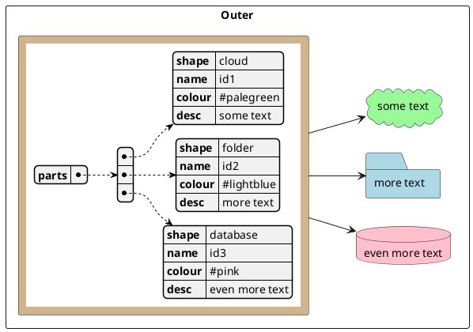

*[Adapted from [QA-12917](https://forum.plantuml.net/12917/how-to-mix-json-objects-into-a-components-diagram?show=12927#c12927)]*


## ``%get_json_keys`` builtin function

You can use ``%get_json_keys`` to get all the keys of one level on a JSON structure.

```plantuml
@startuml
!$myjson = {
"root" : [{
    "fruits": [
        {"name": "apple", "colorId": "1"},
        {"name": "pear", "colorId": "2"},
        {"name": "pineapple", "colorId": "3"}
    ]
},
{
    "colors": [
        {"id": "1", "name": "red"},
        {"id": "2", "name": "green"},
        {"id": "3", "name": "yellow"}
    ]
}]
}

!foreach $key in %get_json_keys($myjson.root)
     rectangle $key
!endfor
@enduml
```

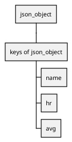


*[Ref. [QA-15360](https://forum.plantuml.net/15360/ideas-for-2-new-json-builtins), [QA-15423](https://forum.plantuml.net/15423/functions-check-exists-default-value-get_variable_value)]*


## ``%get_json_type`` builtin function

You can use ``%get_json_type`` to get the type of an element of a JSON structure (returns a string).
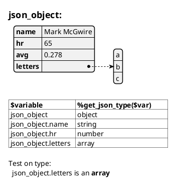

*[Ref. [QA-15360](https://forum.plantuml.net/15360/ideas-for-2-new-json-builtins)]*


## `` %json_key_exists`` builtin function

You can use ``%json_key_exists`` to know if a key exists on a JSON structure (returns a boolean).

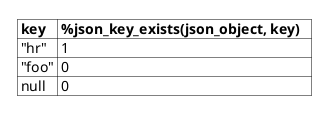

*[Ref. [QA-15423](https://forum.plantuml.net/15423/functions-check-exists-default-value-get_variable_value)]*


## `` %size`` builtin function

You can use ``%size`` to know the size of different elements on a JSON structure.

For each type here are the return value:
| **Type**             | **Return value** |
| -------------------  | ---------------- |
| `JSON Object`        | the number of pairs it contains      |
| `JSON Array`         | the number of values it contains     |
| `string` value       | the number of characters it contains |
| `numeric` value      | zero |
| `true`/`false`/`null`| zero |

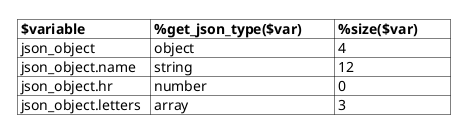

*[Ref. [QA-14901](https://forum.plantuml.net/14901/number-of-elements-in-list-during-json-preprocessing)]*


## ``%json_add`` builtin function

You can use ``%json_add`` to add element on an existing JSON structure (returns the final JSON structure).

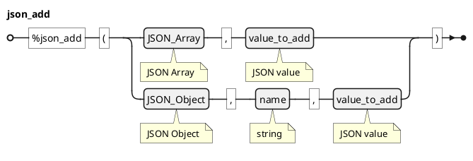

```plantuml
@startjson
!$a = {"age" : 30}
%json_add($a, name, Bob)
@endjson
```

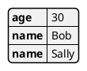

```plantuml
@startjson
!$a = {"age" : 30, "name":"Bob"}
!$b = [1, 2, {"a":0, "b":1}]
%json_add($a, tab, $b)
@endjson
```

*[Ref. [PR-1742](https://github.com/plantuml/plantuml/pull/1742) and [PR-1757](https://github.com/plantuml/plantuml/pull/1757)]*


## ``%json_remove`` builtin function

You can use ``%json_remove`` to remove element on an existing JSON structure (returns the final JSON structure).

```plantuml
@startebnf
json_remove = "%json_remove" , "(",
  ((JSON_Array (* JSON Array *), ",", index_to_remove (* integer *))
  | JSON_Object (* JSON Object *), ",", name_to_remove (* string *)),
")";
@endebnf
```

```plantuml
@startjson
!$a = [1, 2, 3]
%json_remove($a, 1)
@endjson
```

```plantuml
@startjson
!$a = {"age" : 30, "name":"Bob"}
%json_remove($a, age)
@endjson
```

*[Ref. [PR-1742](https://github.com/plantuml/plantuml/pull/1742)]*


## ``%json_set`` builtin function

You can use ``%json_set`` to set element on an existing JSON structure (returns the final JSON structure).

```plantuml
@startebnf
json_set = "%json_set" , "(",
  ((JSON_Array (* JSON Array *), ",", index (* integer *), ",", value_to_set (* JSON value *))
  | (JSON_Object (* JSON Object *), ",", name (* string *), ",", value_to_set (* JSON value *))
  | (JSON_Object (* JSON Object *), "," , JSON_Object_to_set (* JSON Object *))),
")";
@endebnf
```

```plantuml
@startjson
!$a = {"age" : 30, "name":"Bob"}
%json_set($a, name, Sally)
@endjson
```

*[Ref. [PR-1761](https://github.com/plantuml/plantuml/pull/1761)]*

```plantuml
@startjson
!$a = {"partlen": "2", "color": {"A":"red", "B":"blue"}}
!$b = {"color":{"A":"black"}}
%json_set($a, $b)
@endjson
```

*[Ref. [PR-1782](https://github.com/plantuml/plantuml/pull/1782)]*


## ``%json_merge`` builtin function

You can use ``%json_merge`` to merge JSON structures (returns the final JSON structure).

```plantuml
@startebnf
json_merge = "%json_merge" , "(",
  ((JSON_Array (* JSON Array *), ",", JSON_Array_to_merge (* JSON Array *))
  | (JSON_Object (* JSON Object *), ",", JSON_Object_to_merge (* JSON Object *)))
,")";
@endebnf
```

```plantuml
@startjson
!$a = {"age" : 30, "name":"Bob"}
!$b = {"glasses": true}
%json_merge($a, $b)
@endjson
```


*[Ref. [PR-1763](https://github.com/plantuml/plantuml/pull/1763)]*


## ``%str2json`` builtin function

You can use ``%str2json`` to transform a string value to a	JSON structure.

```plantuml
@startebnf
str2json = "%str2json" , "(", value_to_convert (* string *), ")";
@endebnf
```
Here are some example:
```plantuml
@startuml
label l [
<#ccc>|= String_value |= <U+0025>get_json_type(<U+0025>str2json(String_value)) |
| [1, 2, 3]           | %get_json_type(%str2json('[1, 2, 3]'))                 |
| {"a":1, "b":2}      | %get_json_type(%str2json('{"a":1, "b":2}'))            |
| true                | %get_json_type(%str2json('true'))                      |
| null                | %get_json_type(%str2json('null'))                      |
| it's a string       | %get_json_type(%str2json("it's a string"))             |
| 42                  | %get_json_type(%str2json('42'))                        |
]
@enduml
```

```plantuml
@startuml
label l [
<#ccc>|= String_value |= <U+0025>get_json_type(<U+0025>str2json(String_value)) |
!foreach $item in ["[1, 2, 3]", "{\"a\":1, \"b\":2}", "true", "null", "it's a string", "42"]
| $item | %get_json_type(%str2json($item)) |
!endfor
]
@enduml
```


> 🚩 **Known issue**:
> Unfortunately, be careful with quote management.
> 
> Some issues occur when a single quote is contained in a string when the entire string is surrounded by single quote.

*[Ref. [PR-1742](https://github.com/plantuml/plantuml/pull/1742)]*


