## Preprocessing

Some preprocessing capabilities are included in **PlantUML**,
and available for *all* diagrams.

Those functionalities are very similar to the [C language preprocessor](http://en.wikipedia.org/wiki/C_preprocessor), except that the special character ``#`` has been changed to the exclamation mark ``!``.


## Variable definition [=, ?=]

Although this is not mandatory, we highly suggest that variable names start with a ``$``.

There are three types of data:
* **Integer number** *(int)*;
* **String** *(str)* - these must be surrounded by single quote or double quote;
* **JSON*** *(JSON) - either JSON Array or JSON Object or JSON value created by `%str2json`.
*(for JSON variable definition and usage, see more details on [Preprocessing-JSON page](preprocessing-json))*

Variables created outside function are **global**, that is you can access them from everywhere (including from functions). You can emphasize this by using the optional ``global`` keyword when defining a variable.


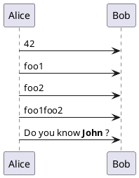


You can also assign a value to a variable, only if it is not already defined, with the syntax: ``!$a ?= "foo"``

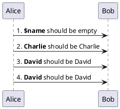


## Boolean expression

### Boolean representation [0 is false]

There is not real boolean type, but PlantUML use this integer convention:

* Integer ``0`` means ``false`` 
* and any non-null number (as ``1``) or any string (as ``"1"``, or even ``"0"``) means ``true``.

*[Ref. [QA-9702](https://forum.plantuml.net/9702/%25false-returns-0-not-false-%25true-returns-1-not-true?show=9710#a9710)]*

### Boolean operation and operator [&&, \|\|, ()]
You can use boolean expression, in the test, with :
* *parenthesis* ``()``;
* *and operator* ``&&``;
* *or operator* ``||``. 

*(See next example, within ``if`` test.)*


### Boolean builtin functions [%false(), %true(), %not(<exp>), %boolval(<exp>)]
For convenience, you can use those boolean builtin functions:

* ``%false()``
* ``%true()``
* ``%not(<exp>)``
* ``%boolval(<exp>)``


*[See also [Builtin functions](preprocessing#0umqmmdy1n9yk362kjka)]*
*[Ref. [PR-1873](https://github.com/plantuml/plantuml/pull/1873)]*


## Conditions [!if, !else, !elseif, !endif]

* You can use expression in condition.
* *else* and *elseif* are also implemented

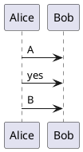


## While loop [!while, !endwhile]

You can use `!while` and `!endwhile` keywords to have repeat loops. 

### While loop (on Activity diagram)

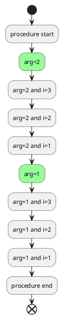

*[Adapted from [QA-10838](https://forum.plantuml.net/10838/there-better-way-implement-while-loop-perprocess-function?show=10870#a10870)]*

### While loop (on Mindmap diagram)
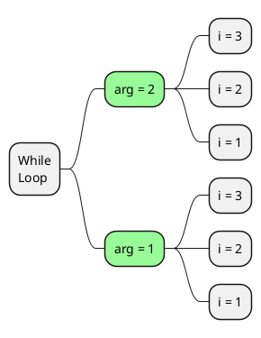

### While loop (on Component/Deployment diagram)

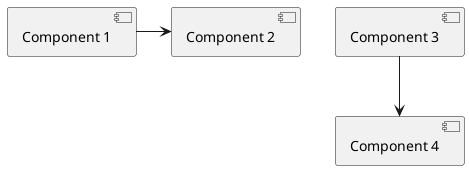

*[Ref. [QA-14088](https://forum.plantuml.net/14088/how-to-generate-a-series-of-same-component-at-once?show=14089#a14089)]*


## Procedure [!procedure, !endprocedure]

* Procedure names *should* start with a ``$``
* Argument names *should* start with a ``$``
* Procedures can call other procedures 

Example:


```plantuml
@startuml
!procedure $msg($source, $destination)
  $source --> $destination
!endprocedure

!procedure $init_class($name)
  class $name {
    $addCommonMethod()
  }
!endprocedure


!procedure $addCommonMethod()
  toString()
  hashCode()
!endprocedure


$init_class("foo1")
$init_class("foo2")
$msg("foo1", "foo2")
@enduml
```

Variables defined in procedures are **local**. It means that the variable is destroyed when the procedure ends.


## Return function [!function, !endfunction]

A return function does not output any text.
It just define a function that you can call:
* directly in variable definition or in diagram text
* from other return functions
* from procedures


* Function name *should* start with a ``$``
* Argument names *should* start with a ``$``

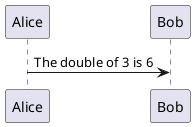

It is possible to shorten simple function definition in one line:

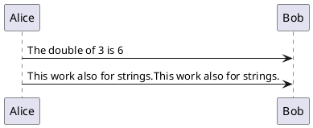

As in procedure (void function), variable are local by default (they are destroyed when the function is exited). However, you can access to global variables from function. However, you can use the ``local`` keyword to create a local variable if ever a global variable exists with the same name.

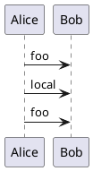


## Default argument value

In both procedure and return functions, you can define default values for arguments.

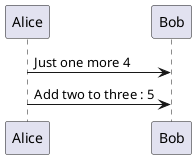

Only arguments at the end of the parameter list can have default values.

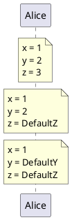


## Unquoted procedure or function [!unquoted]

By default, you have to put quotes when you call a function or a procedure.
It is possible to use the ``unquoted`` keyword to indicate that a function or a procedure does not require quotes for its arguments.


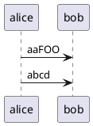


## Keywords arguments

Like in Python, you can use keywords arguments :

```plantuml
@startuml

!unquoted procedure $element($alias, $description="", $label="", $technology="", $size=12, $colour="green")
rectangle $alias as "
<color:$colour><<$alias>></color>
==$label==
//<size:$size>[$technology]</size>//

  $description"
!endprocedure

$element(myalias, "This description is %newline()on several lines", $size=10, $technology="Java")
@enduml
```


## Including files or URL [!include, !include\_many, !include\_once]

Use the ``!include`` directive to include file in your diagram. Using URL, you can also include file from Internet/Intranet. Protected Internet resources can also be accessed, this is described in [URL authentication](url-authentication).

Imagine you have the very same class that appears in many
diagrams. Instead of duplicating the description of this class, you can
define a file that contains the description.

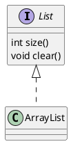

**File List.iuml**
```
interface List
List : int size()
List : void clear()
```

The file ``List.iuml`` can be included in many diagrams, and
any modification in this file will change all diagrams that include it.

You can also put several ``@startuml/@enduml`` text block in an included file and then specify which block
you want to include adding ``!0`` where ``0`` is the block number. The ``!0`` notation denotes the first diagram.

For example, if you use ``!include foo.txt!1``, the second ``@startuml/@enduml`` block
within ``foo.txt`` will be included.

You can also put an id to some ``@startuml/@enduml`` text block in an included file using
``@startuml(id=MY_OWN_ID)`` syntax and then include the block adding ``!MY_OWN_ID`` when including the file,
so using something like ``!include foo.txt!MY_OWN_ID``.

By default, a file can only be included once. You can use ``!include_many`` instead of ``!include`` if you want to include some file several times. Note that there is also a ``!include_once`` directive that raises an error if a file is included several times.


## Including Subpart [!startsub, !endsub, !includesub]

You can also use ``!startsub NAME`` and ``!endsub`` to indicate sections of text to include from other files using ``!includesub``. For example:

**file1.puml:**
```
@startuml

A -> A : stuff1
!startsub BASIC
B -> B : stuff2
!endsub
C -> C : stuff3
!startsub BASIC
D -> D : stuff4
!endsub
@enduml
```

file1.puml would be rendered exactly as if it were:
```
@startuml

A -> A : stuff1
B -> B : stuff2
C -> C : stuff3
D -> D : stuff4
@enduml
```


However, this would also allow you to have another file2.puml like this:

**file2.puml**
```
@startuml

title this contains only B and D
!includesub file1.puml!BASIC
@enduml
```

This file would be rendered exactly as if:

```
@startuml

title this contains only B and D
B -> B : stuff2
D -> D : stuff4
@enduml
```


## Builtin functions [%]

Some functions are defined by default. Their name starts by ``%``

| Name                     | Description                                                                                                                                         | Example                                                   | Return                                           |
| ------------------------ | --------------------------------------------------------------------------------------------------------------------------------------------------- | --------------------------------------------------------- | ------------------------------------------------ |
| ``%boolval``             | Convert a value _(String, Integer, JSON value)_ to boolean value                                                                                    | ``%boolval("true")``                                      | ``1``                                           |
| ``%call_user_func``      | Invoke a return function by its name with given arguments.                                                                                          | ``%call_user_func("bold", "Hello")``                      | Depends on the called function                   |
| ``%chr``                 | Return a character from a give Unicode value                                                                                                        | ``%chr(65)``                                              | ``A``                                            |
| ``%darken``              | Return a darken color of a given color with some ratio                                                                                              | ``%darken("red", 20)``                                    | ``#CC0000``                                      |
| ``%date``                | Retrieve current date. You can provide an optional [format for the date](https://docs.oracle.com/javase/7/docs/api/java/text/SimpleDateFormat.html) | ``%date("yyyy.MM.dd' at 'HH:mm")``                        | current date                                     |
|                          | You can provide another optional time ([on epoch format](https://en.wikipedia.org/wiki/Epoch%5F%28computing%29))                                    | ``%date("YYYY-MM-dd", %now() + 1*24*3600)``               | tomorrow date                                    |
| ``%dec2hex``             | Return the hexadecimal string (String) of a decimal value (Int)                                                                                     | ``%dec2hex(12)``                                          | ``c``                                            |
| ``%dirpath``             | Retrieve current dirpath                                                                                                                            | ``%dirpath()``                                            | current path                                     |
| ``%feature``             | Check if some feature is available in the current PlantUML running version                                                                          | ``%feature("theme")``                                     | ``true``                                         |
| ``%false``               | Return always ``false``                                                                                                                             | ``%false()``                                              | ``false``                                        |
| ``%file_exists``         | Check if a file exists on the local filesystem                                                                                                      | ``%file_exists("c:/foo/dummy.txt")``                      | ``true`` if the file exists                      |
| ``%filename``            | Retrieve current filename                                                                                                                           | ``%filename()``                                           | current filename                                 |
| ``%function_exists``     | Check if a function exists                                                                                                                          | ``%function_exists("$some_function")``                    | ``true`` if the function has been defined        |
| ``%get_all_theme``       | Retreive a JSON Array of all PlantUML [theme](theme)                                                                                                | ``%get_all_theme()``                                      | ``["_none_", "amiga", ..., "vibrant"]``          |
| ``%get_all_stdlib``      | Retreive a JSON Array of all PlantUML [stdlib](stdlib) names                                                                                        | ``%get_all_stdlib()``                                     | ``["archimate", "aws", ..., "tupadr3"]``         |
| ``%get_all_stdlib``      | Retreive a JSON Object of all PlantUML [stdlib](stdlib) information                                                                                 | ``%get_all_stdlib(detailed)``                             | a JSON Object with stdlib information            |
| ``%get_variable_value``  | Retrieve some variable value                                                                                                                        | ``%get_variable_value("$my_variable")``                   | the value of the variable                        |
| ``%getenv``              | Retrieve environment variable value                                                                                                                 | ``%getenv("OS")``                                         | the value of ``OS`` variable                     |
| ``%hex2dec``             | Return the decimal value (Int) of a hexadecimal string (String)                                                                                     | ``%hex2dec("d")`` or ``%hex2dec(d)``                      | ``13``                                           |
| ``%hsl_color``           | Return the RGBa color from a HSL color ``%hsl_color(h, s, l)`` or ``%hsl_color(h, s, l, a)``                                                        | ``%hsl_color(120, 100, 50)``                              | ``#00FF00``                                      |
| ``%intval``              | Convert a String to Int                                                                                                                             | ``%intval("42")``                                         | ``42``                                           |
| ``%invoke_procedure``    | Dynamically invoke a procedure by its name, passing optional arguments to the called procedure.                                                     | ``%invoke_procedure("$go", "hello from Bob...")``         | Depends on the invoked procedure                 |
| ``%is_dark``             | Check if a color is a dark one                                                                                                                      | ``%is_dark("#000000")``                                   | ``true``                                         |
| ``%is_light``            | Check if a color is a light one                                                                                                                     | ``%is_light("#000000")``                                  | ``false``                                        |
| ``%lighten``             | Return a lighten color of a given color with some ratio                                                                                             | ``%lighten("red", 20)``                                   | ``#CC3333``                                      |
| ``%load_json``           | [Load JSON data from local file or external URL](https://github.com/plantuml/plantuml/pull/755)                                                     | ``%load_json("http://localhost:7778/management/health")`` | JSON data                                        |
| ``%lower``               | Return a lowercase string                                                                                                                           | ``%lower("Hello")``                                       | ``hello`` in that example                        |
| ``%mod``                 | Return the remainder of division of two integers (modulo division)                                                                                  | ``%mod(10, 3)``                                           | ``1``                                            |
| ``%newline``             | Return a newline                                                                                                                                    | ``%newline()``                                            | a newline                                        |
| ``%not``                 | Return the logical negation of an expression                                                                                                        | ``%not(2+2==4)``                                          | ``false`` in that example                        |
| ``%now``                 | Return the current epoch time                                                                                                                       | ``%now()``                                                | ``1685547132`` in that example (when updating the doc.) |
| ``%ord``                 | Return a Unicode value from a given character                                                                                                       | ``%ord("A")``                                             |  ``65``                                          |
| ``%lighten``             | Return a lighten color of a given color with some ratio                                                                                             | ``%lighten("red", 20)``                                   | ``#CC3333``                                      |
| ``%random()``            | Return randomly the integer `0` or `1`                                                                                                              | ``%random()``                                             | `0` or `1`                                       |
| ``%random(n)``           | Return randomly an interger between `0` and `n - 1`                                                                                                 | ``%random(5)``                                            | `3`                                              |
| ``%random(min, max)``    | Return randomly an interger between `min` and `max - 1`                                                                                             | ``%random(7, 15)``                                        | `13`                                             |
| ``%reverse_color``       | Reverse a color using RGB                                                                                                                           | ``%reverse_color("#FF7700")``                             | ``#0088FF``                                      |
| ``%reverse_hsluv_color`` | Reverse a color [using HSLuv](https://www.hsluv.org/)                                                                                               | ``%reverse_hsluv_color("#FF7700")``                       | ``#602800``                                      |
| ``%set_variable_value``  | Set a global variable                                                                                                                               | ``%set_variable_value("$my_variable", "some_value")``     | an empty string                                  |
| ``%size``                | Return the size of any string or JSON structure                                                                                                     | ``%size("foo")``                                          | ``3`` in the example                             |
| ``%splitstr``            | Split a string into an array based on a specified delimiter.                                                                                        | ``%splitstr("abc~def~ghi", "~")``                         | ``["abc", "def", "ghi"]``                        |
| ``%splitstr_regex``      | Split a string into an array based on a specified REGEX.                                                                                            | ``%splitstr_regex("AbcDefGhi", "(?=[A-Z])")``             | ``["Abc", "Def", "Ghi"]``                        |
| ``%string``              | Convert an expression to String                                                                                                                     | ``%string(1 + 2)``                                        | ``3`` in the example                             |
| ``%strlen``              | Calculate the length of a String                                                                                                                    | ``%strlen("foo")``                                        | ``3`` in the example                             |
| ``%strpos``              | Search a substring in a string                                                                                                                      | ``%strpos("abcdef", "ef")``                               | 4 (position of ``ef``)                           |
| ``%substr``              | Extract a substring. Takes 2 or 3 arguments                                                                                                         | ``%substr("abcdef", 3, 2)``                               | ``"de"`` in the example                          |
| ``%true``                | Return always ``true``                                                                                                                              | ``%true()``                                               | ``true``                                         |
| ``%upper``               | Return an uppercase string                                                                                                                          | ``%upper("Hello")``                                       | ``HELLO`` in that example                        |
| ``%variable_exists``     | Check if a variable exists                                                                                                                          | ``%variable_exists("$my_variable")``                      | ``true`` if the variable has been defined exists |
| ``%version``             | Return PlantUML current version                                                                                                                     | ``%version()``                                            | ``1.2020.8`` for example                         |


## Logging [!log]

You can use ``!log`` to add some log output when generating the diagram. This has no impact at all on the diagram itself. However, those logs are printed in the command line's output stream. This could be useful for debug purpose.

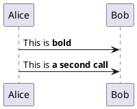


## Memory dump [!dump_memory]

You can use ``!dump_memory`` to dump the full content of the memory when generating the diagram. An optional string can be put after ``!dump_memory``. This has no impact at all on the diagram itself. This could be useful for debug purpose.

```plantuml
@startuml
!function $inc($string)
!$val = %intval($string)
!log value is $val
!dump_memory
!return $val+1
!endfunction

Alice -> Bob : 4 $inc("3")
!unused = "foo"
!dump_memory EOF
@enduml
```


## Assertion [!assert]

You can put assertions in your diagram.


```plantuml
@startuml
Alice -> Bob : Hello
!assert %strpos("abcdef", "cd")==3 : "This always fails"
@enduml
```


## Building custom library [!import, !include]

It's possible to package a set of included files into a single .zip or .jar archive.
This single zip/jar can then be imported into your diagram using ``!import`` directive.

Once the library has been imported, you can ``!include`` file from this single zip/jar.

**Example:**
```
@startuml

!import /path/to/customLibrary.zip
' This just adds "customLibrary.zip" in the search path

!include myFolder/myFile.iuml
' Assuming that myFolder/myFile.iuml is located somewhere
' either inside "customLibrary.zip" or on the local filesystem

...
```


## Search path

You can specify the java property ``plantuml.include.path`` in the command line.

For example:

```
java -Dplantuml.include.path="c:/mydir" -jar plantuml.jar atest1.txt
```


Note the this -D option has to put before the -jar option. -D options
after the -jar option will be used to define constants within plantuml preprocessor.


## Argument concatenation [##]


It is possible to append text to a macro argument using the ``##`` syntax.

```plantuml
@startuml
!unquoted procedure COMP_TEXTGENCOMP(name)
[name] << Comp >>
interface Ifc << IfcType >> AS name##Ifc
name##Ifc - [name]
!endprocedure
COMP_TEXTGENCOMP(dummy)
@enduml
```


## Dynamic invocation [``%invoke_procedure()``,  ``%call_user_func()``]

You can dynamically invoke a procedure using the special ``%invoke_procedure()`` procedure.
This procedure takes as first argument the name of the actual procedure to be called. The optional following arguments are copied to the called procedure.

For example, you can have:

```plantuml
@startuml
!procedure $go()
  Bob -> Alice : hello
!endprocedure

!$wrapper = "$go"

%invoke_procedure($wrapper)
@enduml
```

```plantuml
@startuml
!procedure $go($txt)
  Bob -> Alice : $txt
!endprocedure

%invoke_procedure("$go", "hello from Bob...")
@enduml
```


For return functions, you can use the corresponding special function ``%call_user_func()`` :

```plantuml
@startuml
!function bold($text)
!return "<b>"+ $text +"</b>"
!endfunction

Alice -> Bob : %call_user_func("bold", "Hello") there
@enduml
```


## Evaluation of addition depending of data types [+]

Evaluation of ``$a + $b`` depending of type of `$a` or `$b`
```plantuml
@startuml
title
<#LightBlue>|= |=  $a |=  $b |=  <U+0025>string($a + $b)|
<#LightGray>| type | str | str | str (concatenation) |
| example |= "a" |= "b" |= %string("a" + "b") |
<#LightGray>| type | str | int | str (concatenation) |
| ex.|= "a" |=  2  |= %string("a" + 2)   |
<#LightGray>| type | str | int | str (concatenation) |
| ex.|=  1  |= "b" |= %string(1 + "b")   |
<#LightGray>| type | bool | str | str (concatenation) |
| ex.|= <U+0025>true() |= "b" |= %string(%true() + "b") |
<#LightGray>| type | str | bool | str (concatenation) |
| ex.|= "a" |= <U+0025>false() |= %string("a" + %false()) |
<#LightGray>| type |  int  |  int | int (addition of int) |
| ex.|=  1  |=  2  |= %string(1 + 2)     |
<#LightGray>| type |  bool  |  int | int (addition) |
| ex.|= <U+0025>true() |= 2 |= %string(%true() + 2) |
<#LightGray>| type |  int  |  bool | int (addition) |
| ex.|=  1  |= <U+0025>false() |= %string(1 + %false()) |
<#LightGray>| type |  int  |  int | int (addition) |
| ex.|=  1  |=  <U+0025>intval("2")  |= %string(1 + %intval("2")) |
end title
@enduml
```


## Preprocessing JSON

You can extend the functionality of the current Preprocessing with [JSON Preprocessing](preprocessing-json) features:

* JSON Variable definition
* Access to JSON data
* Loop over JSON array

*(See more details on [Preprocessing-JSON page](preprocessing-json))*


## Including theme [!theme]

Use the ``!theme`` directive to change [the default theme of your diagram](theme).

```plantuml
@startuml
!theme spacelab
class Example {
  Theme spacelab
}
@enduml
```

You will find more information [on the dedicated page](theme).


## Migration notes

The current preprocessor is an update from some legacy preprocessor.

Even if some legacy features are still supported with the actual preprocessor, you should not use them any more (they might be removed in some long term future).

* You should not use ``!define`` and ``!definelong`` anymore. Use ``!function``, ``!procedure`` or variable definition instead. 
 * ``!define`` should be replaced by return ``!function``
 * ``!definelong`` should be replaced by ``!procedure``.
* ``!include`` now allows multiple inclusions : you don't have to use ``!include_many`` anymore
* ``!include`` now accepts a URL, so you don't need ``!includeurl``
* Some features (like ``%date%``) have been replaced by builtin functions (for example ``%date()``)
* When calling a legacy ``!definelong`` macro with no arguments, you do have to use parenthesis. You have to use ``my_own_definelong()`` because ``my_own_definelong`` without parenthesis is not recognized by the new preprocessor.


Please contact us if you have any issues.


## `%splitstr` builtin function

```plantuml
@startmindmap
!$list = %splitstr("abc~def~ghi", "~")

* root
!foreach $item in $list
  ** $item
!endfor
@endmindmap
```

Similar to:
```plantuml
@startmindmap
* root
!foreach $item in ["abc", "def", "ghi"]
  ** $item
!endfor
@endmindmap
```

*[Ref. [QA-15374](https://forum.plantuml.net/15374/delimited-string-split-into-an-array)]*


## `%splitstr_regex` builtin function

```plantuml
@startmindmap
!$list = %splitstr_regex("AbcDefGhi", "(?=[A-Z])")

* root
!foreach $item in $list
  ** $item
!endfor
@endmindmap
```

Similar to:
```plantuml
@startmindmap
* root
!foreach $item in ["Abc", "Def", "Ghi"]
  ** $item
!endfor
@endmindmap
```

*[Ref. [QA-18827](https://forum.plantuml.net/18827/%25splitstr-please-add-regex-support-as-second-argument)]*


## ``%get_all_theme`` builtin function

You can use the ``%get_all_theme()`` builtin function to retreive a JSON array of all PlantUML [theme](theme).

```plantuml
@startjson
%get_all_theme()
@endjson
```

_[from version 1.2024.4]_


## ``%get_all_stdlib`` builtin function

### Compact version (only standard library name)

You can use the ``%get_all_stdlib()`` builtin function to retreive a JSON array of all PlantUML [stdlib](stdlib) names.

```plantuml
@startjson
%get_all_stdlib()
@endjson
```


### Detailed version (with version and source)

With whatever parameter, you can use ``%get_all_stdlib(detailed)`` to retreive a JSON object of all PlantUML [stdlib](stdlib).

```plantuml
@startjson
%get_all_stdlib(detailed)
@endjson
```

_[from version 1.2024.4]_


## `%random` builtin function

You can use the `%random` builtin function to retreive a random integer.

| Nb param. | Input | Output |
| --------- | ----- | ------ |
| 0 | %random()         | returns _0_ or _1_ |
| 1 | %random(n)        | returns an interger between _0_ and _n - 1_ |
| 2 | %random(min, max) | returns an interger between _min_ and _max - 1_ |

```plantuml
@startcreole
| Nb param. | Input | Output |
| 0 | <U+0025>random()      | %random()     |
| 1 | <U+0025>random(5)     | %random(5)    |
| 2 | <U+0025>random(7, 15) | %random(7, 15) |
@endcreole
```

_[from version 1.2024.2]_


## `%boolval` builtin function

You can use the `%boolval` builtin function to manage boolean value.

```plantuml
@startcreole
<#ccc>|= Input                               |= Output |
| <U+0025>boolval(1)                         | %boolval(1) |
| <U+0025>boolval(0)                         | %boolval(0) |
| <U+0025>boolval(<U+0025>true())            | %boolval(%true()) |
| <U+0025>boolval(<U+0025>false())           | %boolval(%false()) |
| <U+0025>boolval(true)                      | %boolval(true) |
| <U+0025>boolval(false)                     | %boolval(false) |
| <U+0025>boolval(TRUE)                      | %boolval(TRUE) |
| <U+0025>boolval(FALSE)                     | %boolval(FALSE) |
| <U+0025>boolval("true")                    | %boolval("true") |
| <U+0025>boolval("false")                   | %boolval("false") |
| <U+0025>boolval(<U+0025>str2json("true"))  | %boolval(%str2json("true")) |
| <U+0025>boolval(<U+0025>str2json("false")) | %boolval(%str2json("false")) |
@endcreole
```


*[Ref. [PR-1873](https://github.com/plantuml/plantuml/pull/1873), from version 1.2024.7]*


