## Display Regex Data

----
🚧 - *Under construction*

🆕 functionality still in testing stage...
These new features are still under construction 🚧

🚧 - *Under construction*
----

You can use PlantUML to visualize your [Regular expression (Regex)](https://en.wikipedia.org/wiki/Regular_expression).

To activate this feature, the diagram must:
* begin with ``@startregex`` keyword
* end with ``@endregex`` keyword. 

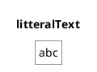
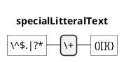
```plantuml
@startregex
tite shorthandCharacterClasses
\d\w\s
@endregex
```
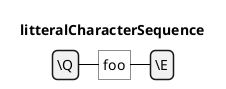
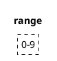
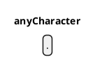
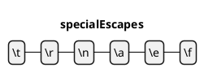
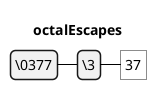
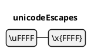
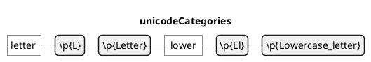
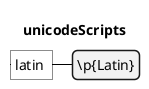
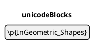
↵
### Order
↵
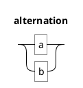
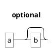
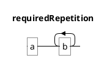
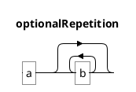
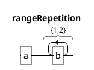
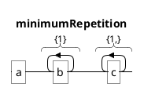
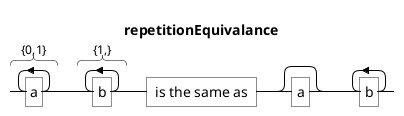
↵
### Miscellaneous
↵
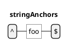
```plantuml
@startregex
title wordBoundries
\bword\b
@endregex
```
```plantuml
@startregex
title namedGroups
a(?<number>\d+)b
@endregex
```
```plantuml
@startregex
title comments
\d(?#any diget)
@endregex
```

Ref.:
* [Regex on GH@plantuml/plantuml](https://github.com/plantuml/plantuml/tree/master/src/net/sourceforge/plantuml/regex)
* [QA-17112](https://forum.plantuml.net/17112/regex-railroad-diagrams)
* [QA-17357](https://forum.plantuml.net/17357/documentation-of-hcl-and-regex)


