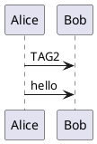
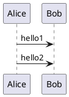
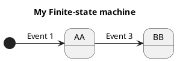

## How and where diagrams can be written
Each diagram description begins with the keyword ``@startuml``
then ends with the keyword ``@enduml`` or (``@startXYZ`` and ``@endXYZ``, depending of the kind of diagram).

You can refer to [the PlantUML Language Reference Guide](http://sourceforge.net/projects/plantuml/files/PlantUML%20Language%20Reference%20Guide.pdf/download).

Those descriptions may be included into:
* PlantUML file (**.pu** or **.puml**)
* Text files (**.txt**),
* HTML files (**.html** or **.htm**),
* [Java sources files](javadoc) (**.java**),
* C/C++ source files (**.c**, **.h**, **.cpp**, **.hpp** or **.hh**)
* LaTeX sources files (**.tex**),
* [APT files (**.apt**)](http://maven.apache.org/doxia/references/apt-format.html)
* [Word files (**.doc**)](word)
* [URL](server)


Of course, if you use HTML, LaTeX, APT or Java/C/C++ files, you should put
diagram descriptions into comments.


## File naming

By default, the output file (eg ``.png``, ``.svg``) has the same name as the source file used to generate it (only the extension changes).

If a source file contains several instances of ``@startXXX`` then a subfolder is made, and an automatic sequence is added to the output file names.

It is also possible to specify specific output filenames per diagram. For example:
```
@startuml image
Alice->Bob: Authentication Request
Bob-->Alice: Authentication Response
@enduml
```

In this example, the output file will be named ``image.png`` for output format ``-tpng`` (which is the default). You can also specify an extension, but it will be ignored if it doesn't match the output format.

(Please note that you should not use this feature with *Word* integration.)


## Include with identifier [include]

You can declare some part of a file with an identifier (``id=<identifier>``), as:

Example with a file named `file.pu`:
```
@startuml(id=TAG1)
Alice->Bob : TAG1
@enduml

@startuml(id=TAG2)
Alice->Bob : TAG2
@enduml
```


Then you can include, on one another file, one `id` part with ``!include <filemane>!<id>`` command:
```
@startuml
!include file.pu!TAG2
Alice->Bob : hello
@enduml
```

The corresponding generated output will be:


*[Ref. [QA-4467](https://forum.plantuml.net/4467)]*


## Include with definition identifier (on the same file) [includedef]

You can declare definition (`def`) some part on a file with an `identifier` between the tags ``@startdef(id=<identifier>)`` and ``@enddef``.

Then you can include, on the same file, only one definition part with ``!includedef <identifier>`` command.

Example on a file named `file.pu`:


Then the corresponding generated output will be `file_001.png`, as:


*[Ref. [QA-5769](https://forum.plantuml.net/5769)]*


## Adding options for other tools

You can add options, for other tools, enclosed by `{` and `}`.

Only the first (`<filename>`) is relevant for PlantUML, the others are just skipped, and can be use by other tools.

	
```
@startuml{filename.png, This is my other caption text, width=16cm, option_for_other_tools=value}

@enduml
```

*[Ref. [QA-1466](https://forum.plantuml.net/1466)]*


## Adding output format when using `pipe` mode

⚠ Restriction: Only available when using `pipe` mode.

To specify the output format (`PNG`, [`SVG`](svg), [`ATXT` or `UTXT`](ascii-art)), on `pipe` mode, you can add this command on the input:
```
@@@format png
```
or
```
@@@format svg
```
or
```
@@@format UTXT
```

*[Ref. [QA-10808](https://forum.plantuml.net/10808), [GH-1810](https://github.com/plantuml/plantuml/issues/1810)]*


## Put PlantUML directives on programming source code [`@pause`, `@unpause` and `@append`]

You can put plantuml directives on comments of programming source code by using the keyword:
- `@pause`
- `@unpause`
- `@append`

Here is an example:
```
/// My FSM looks like this:
/// @startuml myfsm
/// title My Finite-state machine
/// @pause

enum {
   // @append state AA
   STATE_AA,
   // @append state BB
   STATE_BB,
};

struct fsm my_fsm = {
    // @append [*] -> AA: Event 1
    { STATE_ENRTY, EVENT_1, STATE_AA },

    // @append AA -> BB: Event 3
    { STATE_AA, EVENT_3, STATE_BB },

    // and so on with a bunch of transitions...
};
/// @unpause
/// @enduml
```

Here is the corresponding diagram generated from the previous input:


*[Ref. [QA-1525](https://forum.plantuml.net/1525/%40pauseuml-for-splitting-uml-code), [QA-5793](https://forum.plantuml.net/5793/plantuml-used-to-document-code)]*


