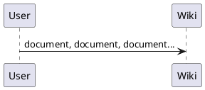

```plantuml
@startuml
...
@enduml
```

## Start

We are thinking about a slightly new way of creating PlantUML documentation.

Right now, this website is still under testing. At some point, the existing wiki will be imported here.

We have decided to support several syntaxes of wikis. Right now you can use:
* [Dokuwiki syntax](syntax-dokuwiki)
* [Markdown syntax](syntax-markdown)
* [Asciidoc syntax](syntax-asciidoc)

And you can [Vote for your syntax!](poll-about-wiki-syntax)

Each user can really use whichever they prefer since the wiki converts users' contributions on the fly.


## Your Help Needed!
It's really easy for people to contribute doc additions and fixes using their favorite syntax.
Most of the important Wanted Features 
(*initially discussed at the [plantuml Documentation project](https://github.com/plantuml/plantuml/issues/67)*) are now implemented, and the PlantUML team will be adding more.

So now it's time for the community to step up and to help documenting this wonderful program better!
Here is how you can help:

* Document your favorite features
* Go through the list of [Undocumented plantuml features](https://github.com/plantuml/plantuml/issues/261) or on **this wiki**, with list for follow [Undocumented PlantUML features in order to document](undocumented) and work out some of them. It's a categorized list of 100-200 tasks that need your help
* Post questions, issues and findings in the [forum](https://forum.plantuml.net/)


## Recommendation and Best practice

* Avoid adding font styles to titles (no raw, italic or bold...)


## Wanted Features

* Fully anonymous access: you won't have to create an account to *edit* contents [[#98FB98#DONE]]
* Advanced SPAM protection: we use branches when people edit content, so spam contributions will not have to be cancelled, they will just be never merged and we won't even have to delete them.  [[#98FB98#DONE]]
* Automatic page creation: just go to [http://alphadoc.plantuml.com/doc/en/any-page-you-want](http://alphadoc.plantuml.com/doc/en/any-page-you-want) [[#98FB98#DONE]]
* Possibility that each contributor uses its favorite wiki syntax. [[#98FB98#DONE]]: asciidoc, dokuwiki, markdown
* Duplication of plantuml code [[#98FB98#DONE]]: shows as source and as diagram
* Automatic generation of PlantUML diagrams [[#98FB98#DONE]]: see next section
* Possibility to create named user/login for serious contributors [[#FFD700#TODO]]
* PDF generation through LaTeX [[#FFD700#TODO]]
* Automatic consistence between translated versions [[#FFD700#TODO]]
* Automatic synchronization with some GitHub repository [[#FFD700#TODO]]
* Automatic TOC/site map on the alphadoc site [[#FFD700#TODO]]
* Automatic TOC/site map on the final site (not only on this alphadoc site) [[#FFD700#TODO]]
* Sync to/from web site [[#FFD700#TODO]]
* Link checking [[#FFD700#TODO]] [#361](https://github.com/plantuml/plantuml/issues/361)
* Ability to Update title/desc* [[#FFD700#TODO]] (currently gives exception [#363](https://github.com/plantuml/plantuml/issues/363))
* Use named anchors (perhaps even automatically anchor <h1>, <h2>, <h3>, ... tag) so you can have stable ``#`` links within the documentation and linking from the outside [[#FFD700#TODO]]
  * For now you can use the [Display #Anchors chrome plugin](https://chrome.google.com/webstore/detail/display-anchors/poahndpaaanbpbeafbkploiobpiiieko) and hand-craft links eg like "alphadoc [sprite#stdlib](http://alphadoc.plantuml.com/doc/markdown/en/sprite#hdvb3xdf1doekdtyqgs2) and [sprite#listing-sprites](http://alphadoc.plantuml.com/doc/markdown/en/sprite#jq1w8ezst4vzkdtyqu8b)" but it's difficult, and those machine-generated anchors aren't guaranteed to be stable


## Demo diagrams

You can use a new special tag `````plantuml`` for diagrams.

```

```

The result is that the PlantUML source is shown, followed by the diagram:




