## PlantUML Standard Library

Welcome to the guide on PlantUML's official **Standard Library** (`stdlib`). Here, we delve into this integral resource that is now included in all official releases of PlantUML, facilitating a richer diagram creation experience. The library borrows its file inclusion convention from the ["C standard library"](https://en.wikipedia.org/wiki/C_standard_library), a well-established protocol in the programming world. 

### Standard Library Overview

The [Standard Library](https://github.com/plantuml/plantuml-stdlib) is a repository of files and resources, constantly updated to enhance your PlantUML experience. It forms the backbone of PlantUML, offering a range of functionalities and features to explore.

### Contribution from the Community

A significant portion of the library's contents are generously provided by third-party contributors. We extend our heartfelt gratitude to them for their invaluable contributions that have played a pivotal role in enriching the library.

We encourage users to delve into the abundant resources the [Standard Library](https://github.com/plantuml/plantuml-stdlib) offers, to not only enhance their diagram crafting experience but also possibly contribute and be a part of this collaborative endeavor. 


## List of Standard Library

You can list standard library folders using the special diagram:

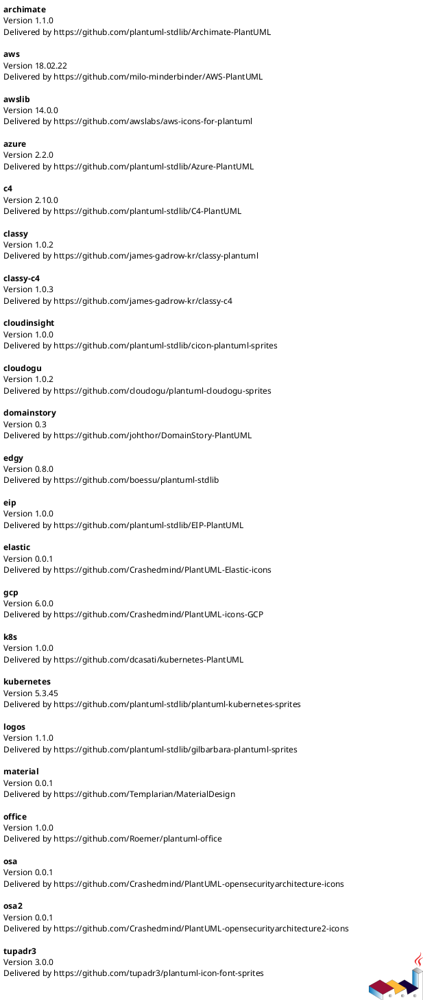

It is also possible to use the command line ``java -jar plantuml.jar -stdlib`` to display the same list.

Finally, you can extract the full standard library sources using ``java -jar plantuml.jar -extractstdlib``. All files will be extracted in the folder ``stdlib``.

Sources used to build official PlantUML releases are hosted here [https://github.com/plantuml/plantuml-stdlib](https://github.com/plantuml/plantuml-stdlib). You can create Pull Request to update or add some library if you find it relevant.


## ArchiMate [archimate]

|  Type   | Link |
| ------- | ---- |
| `stdlib`| [https://github.com/plantuml/plantuml-stdlib/tree/master/archimate](https://github.com/plantuml/plantuml-stdlib/tree/master/archimate) |
| `src`   | [https://github.com/ebbypeter/Archimate-PlantUML](https://github.com/ebbypeter/Archimate-PlantUML) |
| `orig`  | [https://en.wikipedia.org/wiki/ArchiMate](https://en.wikipedia.org/wiki/ArchiMate) |

This repository contains ArchiMate PlantUML macros and other includes for creating [Archimate Diagrams](archimate-diagram) easily and consistantly.


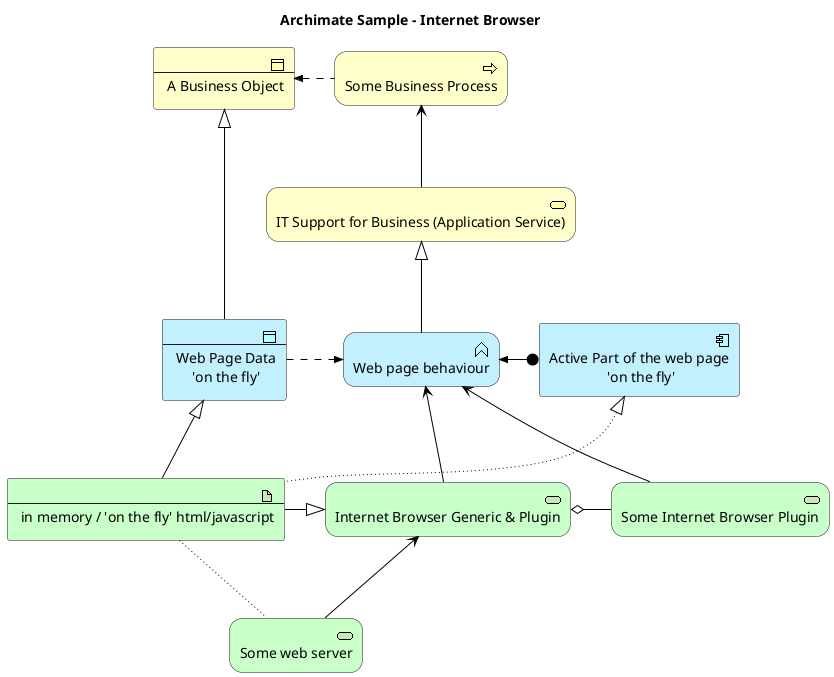

### List possible sprites

You can list all possible [sprites](sprite) for Archimate using the following diagram:

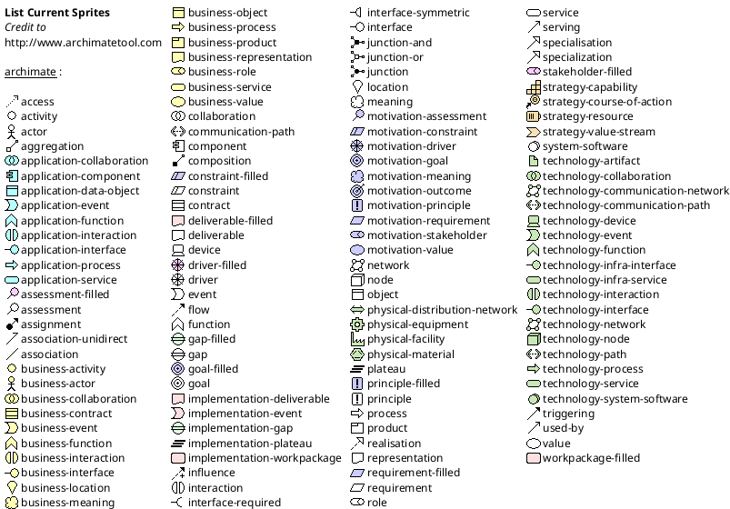


## Amazon Labs AWS Library [awslib]

| Type       | Link                                                                                                                             |
| ---------- | -------------------------------------------------------------------------------------------------------------------------------- |
| ``stdlib`` | [https://github.com/plantuml/plantuml-stdlib/tree/master/awslib](https://github.com/plantuml/plantuml-stdlib/tree/master/awslib) |
| ``src``    | [https://github.com/awslabs/aws-icons-for-plantuml](https://github.com/awslabs/aws-icons-for-plantuml)                           |
| ``orig``   | [https://aws.amazon.com/en/architecture/icons/](https://aws.amazon.com/en/architecture/icons/)                                   |

The Amazon Labs AWS library provides PlantUML sprites, macros, and other includes for Amazon Web Services (AWS) services and resources.

Used to create PlantUML diagrams with AWS components. All elements are generated from the official [AWS Architecture Icons](https://aws.amazon.com/fr/architecture/icons/) and when combined with PlantUML and the [C4 model](https://c4model.com/), are a great way to communicate your design, deployment, and topology as code.


```
@startuml
!include <awslib/AWSCommon>
!include <awslib/InternetOfThings/IoTRule>
!include <awslib/Analytics/KinesisDataStreams>
!include <awslib/ApplicationIntegration/SimpleQueueService>

left to right direction

agent "Published Event" as event #fff

IoTRule(iotRule, "Action Error Rule", "error if Kinesis fails")
KinesisDataStreams(eventStream, "IoT Events", "2 shards")
SimpleQueueService(errorQueue, "Rule Error Queue", "failed Rule actions")

event --> iotRule : JSON message
iotRule --> eventStream : messages
iotRule --> errorQueue : Failed action message
@enduml
```

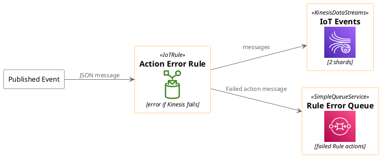


## Azure library [azure]

| Type       | Link                                                                                                                           |
| ---------- | ------------------------------------------------------------------------------------------------------------------------------ |
| ``stdlib`` | [https://github.com/plantuml/plantuml-stdlib/tree/master/azure](https://github.com/plantuml/plantuml-stdlib/tree/master/azure) |
| ``src``    | [https://github.com/RicardoNiepel/Azure-PlantUML/](https://github.com/RicardoNiepel/Azure-PlantUML/)                           |
| ``orig``   | [Microsoft Azure](https://docs.microsoft.com/en-us/azure/architecture/icons/)                                                  |

The Azure library consists of [Microsoft Azure](https://docs.microsoft.com/en-us/azure/architecture/icons/) icons.

Use it by including the file that contains the sprite, eg: ``!include <azure/Analytics/AzureEventHub>``.
When imported, you can use the sprite as normally you would, using ``<$sprite_name>``.

You may also include the ``AzureCommon.puml`` file, eg: ``!include <azure/AzureCommon>``, which contains helper macros defined.
With the ``AzureCommon.puml`` imported, you can use the ``NAME_OF_SPRITE(parameters...)`` macro.

Example of usage:

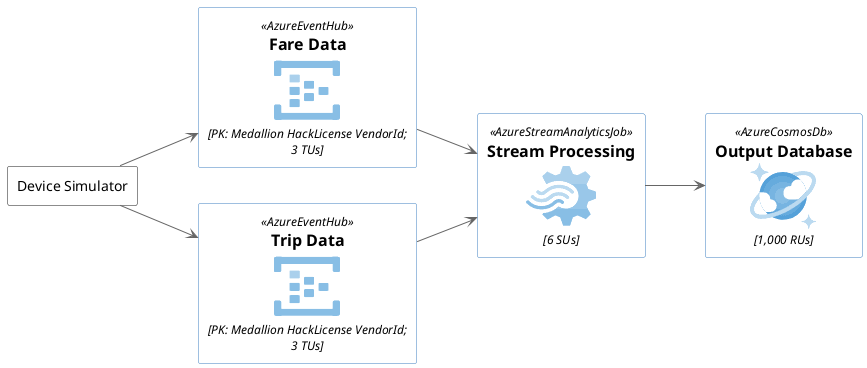


## C4 Library [C4]

|  Type   | Link |
| ------- | ---- |
| `stdlib`| [https://github.com/plantuml/plantuml-stdlib/tree/master/C4](https://github.com/plantuml/plantuml-stdlib/tree/master/C4) |
| `src`   | [https://github.com/plantuml-stdlib/C4-PlantUML](https://github.com/plantuml-stdlib/C4-PlantUML) |
| `orig`  | [https://en.wikipedia.org/wiki/C4_model](https://en.wikipedia.org/wiki/C4_model)\n [https://c4model.com](https://c4model.com) |


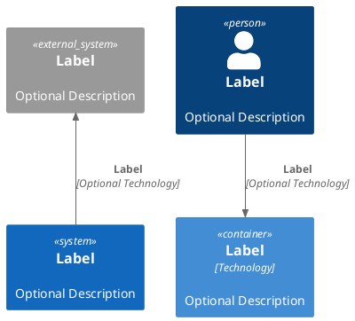


## Cloud Insight [cloudinsight]

|  Type   | Link |
| ------- | ---- |
| `stdlib`| [https://github.com/plantuml/plantuml-stdlib/tree/master/cloudinsight](https://github.com/plantuml/plantuml-stdlib/tree/master/cloudinsight) |
| `src`   | [https://github.com/rabelenda/cicon-plantuml-sprites](https://github.com/rabelenda/cicon-plantuml-sprites) |
| `orig`  | [Cloudinsight icons](https://github.com/cloudinsight/cicon) |

This repository contains PlantUML sprites generated from [Cloudinsight icons](https://github.com/cloudinsight/cicon), which can easily be used in PlantUML diagrams for nice visual representation of popular technologies.

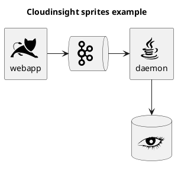


## Cloudogu [cloudogu]

|  Type   | Link |
| ------- | ---- |
| `stdlib`| [https://github.com/plantuml/plantuml-stdlib/tree/master/cloudogu](https://github.com/plantuml/plantuml-stdlib/tree/master/cloudogu) |
| `src`   | [https://github.com/cloudogu/plantuml-cloudogu-sprites](https://github.com/cloudogu/plantuml-cloudogu-sprites) |
| `orig`  | [https://cloudogu.com](https://cloudogu.com) |

The Cloudogu library provides PlantUML sprites, macros, and other includes for Cloudogu  services and resources. 

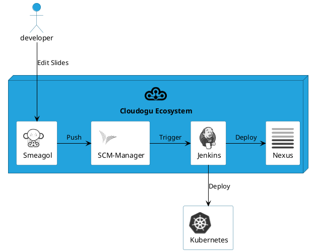

**All cloudogu sprites**

See all possible cloudogu sprites on [plantuml-cloudogu-sprites](https://github.com/cloudogu/plantuml-cloudogu-sprites).


## EDGY: An Open Source tool for collaborative Enterprise Design [edgy]

| Type       | Link                                                                                                                         |
| ---------- | ---------------------------------------------------------------------------------------------------------------------------- |
| ``stdlib`` | [https://github.com/plantuml/plantuml-stdlib/tree/master/edgy](https://github.com/plantuml/plantuml-stdlib/tree/master/edgy) |
| ``src``    | [https://github.com/boessu/plantuml-stdlib/tree/master/edgy](https://github.com/boessu/plantuml-stdlib/tree/master/edgy)     |
| ``orig``   | [https://enterprise.design/](https://enterprise.design/)                                                                     |

> “To become whole, enterprises must embrace a holistic, collaborative way of design:
> transcending silos, combining perspectives, looking for connections instead of divisions. An enterprise designed together works better together.”
>
> – Bard Papegaaij, Wolfgang Goebl and Milan Guenther, curators of EDGY 23

EDGY helps to visualize, communicate, and co-design enterprises across different disciplines.
EDGY is a design language that provides guidelines for enterprises to create effective and efficient digital products, services, and experiences. It was developed by the EDGY team with input from industry experts, researchers, and practitioners in order to address common challenges faced when developing complex systems.
The foundation of Edgy is based on four key principles: simplicity, modularity, scalability, and adaptability. These principles are designed to help enterprises create products that can be easily maintained over time while also being able to scale up or down as needed. Additionally, the language provides a set of guidelines for designing user interfaces, data models, business processes, and more, making it an essential toolkit for any organization looking to improve their offerings.

### Basic Elements and Interconnections
EDGY is an open-source language for enterprise design that uses only four base elements: people, activity, object, and outcome. These elements can be specialized into facet and intersection elements, which describe the enterprise from different perspectives: identity, architecture, and experience.

#### Elements

The basic syntax of an element or a facet is:

``$element/facet("label", [identifier], [lightColor])``

| Parameter  | Description                                                                                                            |
| ---------- | ---------------------------------------------------------------------------------------------------------------------- |
| label      | Mandatory: label of the element.                                                                                       |
| identifier | Dependant: Identifies the element (for creating relations). Optional if you don't link them to other elemets/facets.   |
| lightColor | Optional: 0 sets the standared color. 1 sets a lighter color. As default, facets do have lighter colors than elements. |

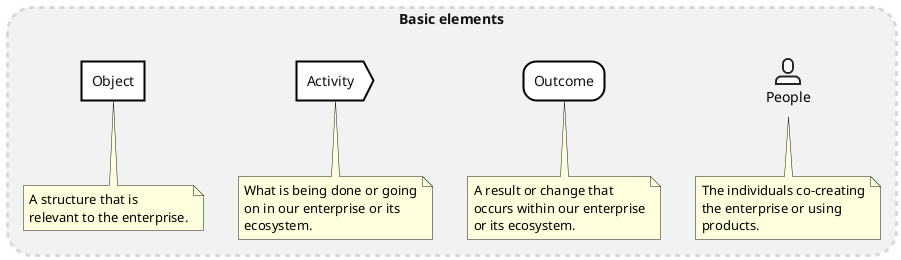

#### Relationships
The elements (or facets) can be connected with three types of relationships: link, flow and tree.

``$link/flow/tree(fromIdentifier, toIdentifier, ["Description"])``

| Parameter      | Description                                               |
| -------------- | --------------------------------------------------------- |
| fromIdentifier | Mandatory: Identifies the starting element of a relation. |
| toIdentifier   | Mandatory: Identifies the ending element of a relation.   |
| label          | Optional: label of the element.                           |

All relations can have a direction hint as a suffix (Up/Down/Left/Right). See examples in the chapter "Facets". While it does often help to give PlantUML (basically GraphViz) a direction hint, it not always helps. if you don't get the exact result you expect: don't waste too much lifetime on it.

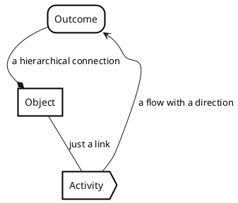

There are quite some hierarchical linking in edgy. Or maps. So it is also possible to group/nesting elements:
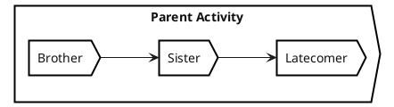

### Facets
A facet is a perspective that relates to any enterprise, featuring a set of questions that an enterprise needs to answer in order to achieve a coherent design. There are three facets in EDGY: Identity, Architecture, and Experience. Each facet references five enterprise elements: three facet elements, and two intersection elements at the overlap with the neighbouring facets.

#### Identity
The Identity Facet describes why the enterprise exists and what it stands for.

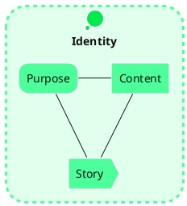

#### Architecture
The Architecture facet is about the structures and processes that enable the enterprise to operate and deliver.

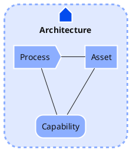

#### Experience
The Experience Facet is about the impact that the enterprise has on people and their lives through its interactions.

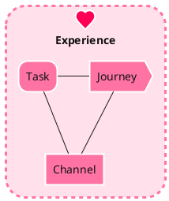

### Intersections
Intersections are lenses that connect facets and disciplines, such as organisation, product, and brand.

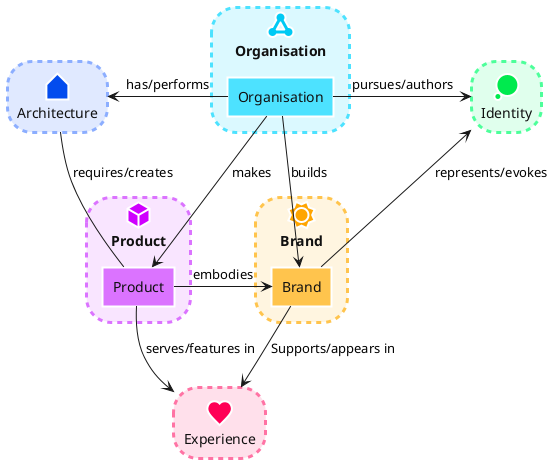


### Alternative visual styling

Finally, there is also an alternative representation that focuses on rectangles with stereotypes. The approach described above is 100% compatible. It can therefore be activated with a simple swap from `!include <edgy/edgy>` to `!include <edgy/edgy2>`.
This can sometimes be useful if the people involved do not immediately know the color codes and concrete meanings of the EDGY elements by heart. Also color-blind people can benefit from this ;-)

```plantuml
@startuml
!include <edgy/edgy2>

$baseFacet("Basic elements") {
  $people("People")
  $outcome("Outcome")
  $activity("Activity")
  $object("Object")
}
@enduml


## Elastic library [elastic]

|  Type   | Link |
| ------- | ---- |
| `stdlib`| [https://github.com/plantuml/plantuml-stdlib/tree/master/elastic](https://github.com/plantuml/plantuml-stdlib/tree/master/elastic) |
| `src`   | [https://github.com/Crashedmind/PlantUML-Elastic-icons](https://github.com/Crashedmind/PlantUML-Elastic-icons) |
| `orig`  | [Elastic](https://www.elastic.co) |

The Elastic library consists of [Elastic](https://www.elastic.co) icons.
It is similar in use to the AWS and Azure libraries (it used the same tool to create them).

Use it by including the file that contains the sprite, eg: ``!include elastic/elastic_search/elastic_search>``.
When imported, you can use the sprite as normally you would, using ``<$sprite_name>``.

You may also include the ``common.puml`` file, eg: ``!include <elastic/common>``, which contains helper macros defined.
With the ``common.puml`` imported, you can use the ``NAME//OF//SPRITE(parameters...)`` macro.

Example of usage:
```plantuml
@startuml
!include <elastic/common>
!include <elastic/elasticsearch/elasticsearch>
!include <elastic/logstash/logstash>
!include <elastic/kibana/kibana>

ELASTICSEARCH(ElasticSearch, "Search and Analyze",database)
LOGSTASH(Logstash, "Parse and Transform",node)
KIBANA(Kibana, "Visualize",agent) 

Logstash -right-> ElasticSearch: Transformed Data
ElasticSearch -right-> Kibana: Data to View
@enduml
```

**All Elastic Sprite Set**

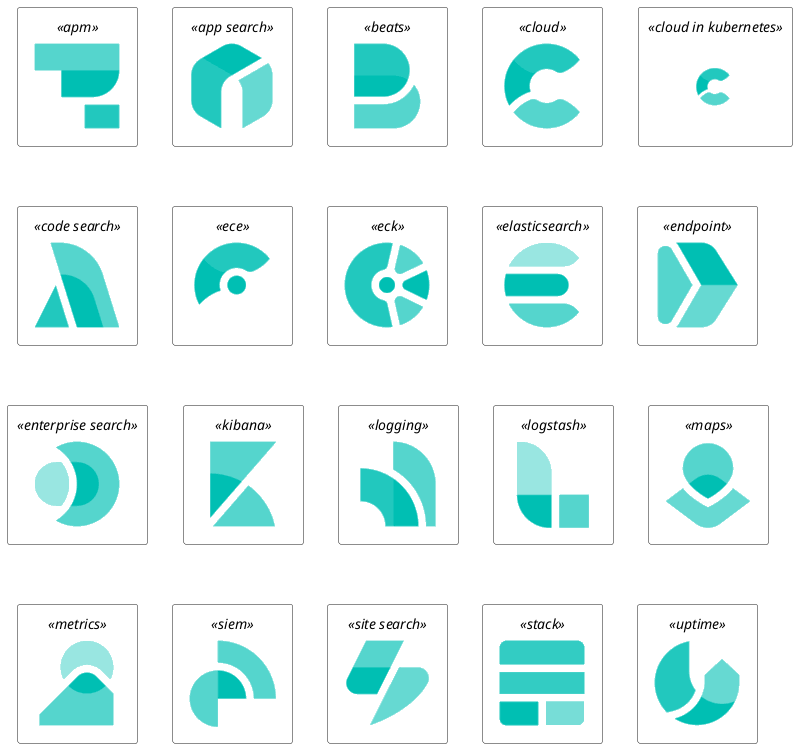


## Google Material Icons [material]

|  Type   | Link |
| ------- | ---- |
| `stdlib`| [https://github.com/plantuml/plantuml-stdlib/tree/master/material](https://github.com/plantuml/plantuml-stdlib/tree/master/material) |
| `src`   | [https://github.com/Templarian/MaterialDesign](https://github.com/Templarian/MaterialDesign) |
| `orig`  | [Material Design Icons](https://materialdesignicons.com) |

This library consists of a free Material style icons from Google and other artists.

Use it by including the file that contains the sprite, eg: ``!include <material/ma_folder_move>``.
When imported, you can use the sprite as normally you would, using ``<$ma_sprite_name>``.
Notice that this library requires an ``ma_`` prefix on sprites names, this is to avoid clash of names if multiple sprites have the same name on different libraries.

You may also include the ``common.puml`` file, eg: ``!include <material/common>``, which contains helper macros defined.
With the ``common.puml`` imported, you can use the ``MA_NAME_OF_SPRITE(parameters...)`` macro, note again the use of the prefix ``MA_``.

Example of usage:

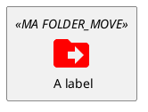

**Notes:**

When mixing sprites macros with other elements you may get a syntax error if, for example, trying to add a rectangle along with classes.
In those cases, add ``{`` and ``}`` after the macro to create the empty rectangle.

Example of usage:

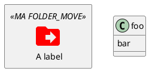


## Kubernetes [kubernetes]

|  Type   | Link |
| ------- | ---- |
| `stdlib`| [https://github.com/plantuml/plantuml-stdlib/tree/master/kubernetes](https://github.com/plantuml/plantuml-stdlib/tree/master/kubernetes) |
| `src`   | [https://github.com/michiel/plantuml-kubernetes-sprites](https://github.com/michiel/plantuml-kubernetes-sprites) |
| `orig`  | [Kubernetes](https://en.wikipedia.org/wiki/Kubernetes) |

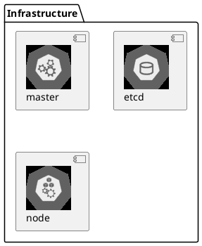


## Logos [logos]

|  Type   | Link |
| ------- | ---- |
| `stdlib`| [https://github.com/plantuml/plantuml-stdlib/tree/master/logos](https://github.com/plantuml/plantuml-stdlib/tree/master/logos) |
| `src`   | [https://github.com/plantuml-stdlib/gilbarbara-plantuml-sprites](https://github.com/plantuml-stdlib/gilbarbara-plantuml-sprites) |
| `orig`  | [Gil Barbara's logos](https://github.com/gilbarbara/logos) |


This repository contains PlantUML sprites generated from [Gil Barbara's logos](https://github.com/gilbarbara/logos), which can easily be used in PlantUML diagrams for nice visual aid.

```plantuml
@startuml
!include <logos/flask>
!include <logos/kafka>
!include <logos/kotlin>
!include <logos/cassandra>

title Gil Barbara's logos example

skinparam monochrome true

rectangle "<$flask>\nwebapp" as webapp
queue "<$kafka>" as kafka
rectangle "<$kotlin>\ndaemon" as daemon
database "<$cassandra>" as cassandra

webapp -> kafka
kafka -> daemon
daemon --> cassandra
@enduml
```

```plantuml
@startuml
scale 0.7
!include <logos/apple-pay>
!include <logos/dinersclub>
!include <logos/discover>
!include <logos/google-pay>
!include <logos/jcb>
!include <logos/maestro>
!include <logos/mastercard>
!include <logos/paypal>
!include <logos/unionpay>
!include <logos/visaelectron>
!include <logos/visa>
' ...

title Gil Barbara's logos example - **Payment Scheme**

actor customer
rectangle "<$apple-pay>"    as ap
rectangle "<$dinersclub>"   as dc
rectangle "<$discover>"     as d
rectangle "<$google-pay>"   as gp
rectangle "<$jcb>"          as j
rectangle "<$maestro>"      as ma
rectangle "<$mastercard>"   as m
rectangle "<$paypal>"       as p
rectangle "<$unionpay>"     as up
rectangle "<$visa>"         as v
rectangle "<$visaelectron>" as ve
rectangle "..." as etc

customer --> ap
customer ---> dc
customer --> d
customer ---> gp
customer --> j
customer ---> ma
customer --> m
customer ---> p
customer --> up
customer ---> v
customer --> ve
customer ---> etc
@enduml
```


## Office [office]

|  Type   | Link |
| ------- | ---- |
| `stdlib`| [https://github.com/plantuml/plantuml-stdlib/tree/master/office](https://github.com/plantuml/plantuml-stdlib/tree/master/office) |
| `src`   | [https://github.com/Roemer/plantuml-office](https://github.com/Roemer/plantuml-office) |
| `orig`  |  |

There are sprites (\*.puml) and colored png icons available. Be aware that the sprites are all only monochrome even if they have a color in their name (due to automatically generating the files). You can either color the sprites with the macro (see examples below) or directly use the fully colored pngs. See the following examples on how to use the sprites, the pngs and the macros.

Example of usage:

```plantuml
@startuml
!include <tupadr3/common>

!include <office/Servers/database_server>
!include <office/Servers/application_server>
!include <office/Concepts/firewall_orange>
!include <office/Clouds/cloud_disaster_red>

title Office Icons Example

package "Sprites" {
    OFF_DATABASE_SERVER(db,DB)
    OFF_APPLICATION_SERVER(app,App-Server)
    OFF_FIREWALL_ORANGE(fw,Firewall)
    OFF_CLOUD_DISASTER_RED(cloud,Cloud)
    db <-> app
    app <--> fw
    fw <.left.> cloud
}
@enduml
```


```plantuml
@startuml
!include <tupadr3/common>

!include <office/servers/database_server>
!include <office/servers/application_server>
!include <office/Concepts/firewall_orange>
!include <office/Clouds/cloud_disaster_red>

' Used to center the label under the images
skinparam defaultTextAlignment center

title Extended Office Icons Example

package "Use sprite directly" {
    [Some <$cloud_disaster_red> object]
}

package "Different macro usages" {
    OFF_CLOUD_DISASTER_RED(cloud1)
    OFF_CLOUD_DISASTER_RED(cloud2,Default with text)
    OFF_CLOUD_DISASTER_RED(cloud3,Other shape,Folder)
    OFF_CLOUD_DISASTER_RED(cloud4,Even another shape,Database)
    OFF_CLOUD_DISASTER_RED(cloud5,Colored,Rectangle, red)
    OFF_CLOUD_DISASTER_RED(cloud6,Colored background) #red
}
@enduml
```


## Open Security Architecture (OSA) [osa]

|  Type   | Link |
| ------- | ---- |
| `stdlib`| [https://github.com/plantuml/plantuml-stdlib/tree/master/osa](https://github.com/plantuml/plantuml-stdlib/tree/master/osa) |
| `src`   | [https://github.com/Crashedmind/PlantUML-opensecurityarchitecture-icons](https://github.com/Crashedmind/PlantUML-opensecurityarchitecture-icons)\n [https://github.com/Crashedmind/PlantUML-opensecurityarchitecture2-icons](https://github.com/Crashedmind/PlantUML-opensecurityarchitecture2-icons) |
| `orig`  | [https://www.opensecurityarchitecture.org](https://www.opensecurityarchitecture.org) |


```plantuml
@startuml
'Adapted from https://github.com/Crashedmind/PlantUML-opensecurityarchitecture-icons/blob/master/all
scale .5
!include <osa/arrow/green/left/left>
!include <osa/arrow/yellow/right/right>
!include <osa/awareness/awareness>
!include <osa/contract/contract>
!include <osa/database/database>
!include <osa/desktop/desktop>
!include <osa/desktop/imac/imac>
!include <osa/device_music/device_music>
!include <osa/device_scanner/device_scanner>
!include <osa/device_usb/device_usb>
!include <osa/device_wireless_router/device_wireless_router>
!include <osa/disposal/disposal>
!include <osa/drive_optical/drive_optical>
!include <osa/firewall/firewall>
!include <osa/hub/hub>
!include <osa/ics/drive/drive>
!include <osa/ics/plc/plc>
!include <osa/ics/thermometer/thermometer>
!include <osa/id/card/card>
!include <osa/laptop/laptop>
!include <osa/lifecycle/lifecycle>
!include <osa/lightning/lightning>
!include <osa/media_flash/media_flash>
!include <osa/media_optical/media_optical>
!include <osa/media_tape/media_tape>
!include <osa/mobile/pda/pda>
!include <osa/padlock/padlock>
!include <osa/printer/printer>
!include <osa/site_branch/site_branch>
!include <osa/site_factory/site_factory>
!include <osa/vpn/vpn>
!include <osa/wireless/network/network>

rectangle "OSA" {
rectangle "Left:\n <$left>"
rectangle "Right:\n <$right>"
rectangle "Awareness:\n <$awareness>"
rectangle "Contract:\n <$contract>"
rectangle "Database:\n <$database>"
rectangle "Desktop:\n <$desktop>"
rectangle "Imac:\n <$imac>"
rectangle "Device_music:\n <$device_music>"
rectangle "Device_scanner:\n <$device_scanner>"
rectangle "Device_usb:\n <$device_usb>"
rectangle "Device_wireless_router:\n <$device_wireless_router>"
rectangle "Disposal:\n <$disposal>"
rectangle "Drive_optical:\n <$drive_optical>"
rectangle "Firewall:\n <$firewall>"
rectangle "Hub:\n <$hub>"
rectangle "Drive:\n <$drive>"
rectangle "Plc:\n <$plc>"
rectangle "Thermometer:\n <$thermometer>"
rectangle "Card:\n <$card>"
rectangle "Laptop:\n <$laptop>"
rectangle "Lifecycle:\n <$lifecycle>"
rectangle "Lightning:\n <$lightning>"
rectangle "Media_flash:\n <$media_flash>"
rectangle "Media_optical:\n <$media_optical>"
rectangle "Media_tape:\n <$media_tape>"
rectangle "Pda:\n <$pda>"
rectangle "Padlock:\n <$padlock>"
rectangle "Printer:\n <$printer>"
rectangle "Site_branch:\n <$site_branch>"
rectangle "Site_factory:\n <$site_factory>"
rectangle "Vpn:\n <$vpn>"
rectangle "Network:\n <$network>"
}
@enduml
```

```plantuml
@startuml
scale .5
!include <osa/user/audit/audit>
'beware of 'hat-sprite'
!include <osa/user/black/hat/hat-sprite>
!include <osa/user/blue/blue>
!include <osa/user/blue/security/specialist/specialist>
!include <osa/user/blue/sysadmin/sysadmin>
!include <osa/user/blue/tester/tester>
!include <osa/user/blue/tie/tie>
!include <osa/user/green/architect/architect>
!include <osa/user/green/business/manager/manager>
!include <osa/user/green/developer/developer>
!include <osa/user/green/green>
!include <osa/user/green/operations/operations>
!include <osa/user/green/project/manager/manager>
!include <osa/user/green/service/manager/manager>
!include <osa/user/green/warning/warning>
!include <osa/user/large/group/group>
!include <osa/users/blue/green/green>
!include <osa/user/white/hat/hat>

listsprites
@enduml
```


## Tupadr3 library [tupadr3]

|  Type   | Link |
| ------- | ---- |
| `stdlib`| [https://github.com/plantuml/plantuml-stdlib/tree/master/tupadr3](https://github.com/plantuml/plantuml-stdlib/tree/master/tupadr3) |
| `src`   | [https://github.com/tupadr3/plantuml-icon-font-sprites](https://github.com/tupadr3/plantuml-icon-font-sprites) |
| `orig`  | [https://github.com/tupadr3/plantuml-icon-font-sprites#icon-sets](https://github.com/tupadr3/plantuml-icon-font-sprites#icon-sets) |

This library contains several libraries of icons (including Devicons and Font Awesome).

Use it by including the file that contains the sprite, eg: ``!include <font-awesome/align_center>``.
When imported, you can use the sprite as normally you would, using ``<$sprite_name>``.

You may also include the ``common.puml`` file, eg: ``!include <font-awesome/common>``, which contains helper macros defined.
With the ``common.puml`` imported, you can use the ``NAME_OF_SPRITE(parameters...)`` macro.

Example of usage:

```plantuml
@startuml
!include <tupadr3/common>
!include <tupadr3/font-awesome/server>
!include <tupadr3/font-awesome/database>

title Styling example

FA_SERVER(web1,web1) #Green
FA_SERVER(web2,web2) #Yellow
FA_SERVER(web3,web3) #Blue
FA_SERVER(web4,web4) #YellowGreen

FA_DATABASE(db1,LIVE,database,white) #RoyalBlue
FA_DATABASE(db2,SPARE,database) #Red

db1 <--> db2

web1 <--> db1
web2 <--> db1
web3 <--> db1
web4 <--> db1
@enduml
```


```plantuml
@startuml
!include <tupadr3/common>
!include <tupadr3/devicons/mysql>

DEV_MYSQL(db1)
DEV_MYSQL(db2,label of db2)
DEV_MYSQL(db3,label of db3,database)
DEV_MYSQL(db4,label of db4,database,red) #DeepSkyBlue
@enduml
```


## AWS library [aws]

| Type       | Link                                                                                                                       |
| ---------- | -------------------------------------------------------------------------------------------------------------------------- |
| ``stdlib`` | [https://github.com/plantuml/plantuml-stdlib/tree/master/aws](https://github.com/plantuml/plantuml-stdlib/tree/master/aws) |
| ``src``    | [https://github.com/milo-minderbinder/AWS-PlantUML](https://github.com/milo-minderbinder/AWS-PlantUML)                     |
| ``orig``   | [https://aws.amazon.com/en/architecture/icons/](https://aws.amazon.com/en/architecture/icons/)                             |

**Warning: We are thinking about deprecating this library. **

So you should probably use ``<awslib>`` instead (see above).

----


The AWS library consists of Amazon AWS icons, it provides icons of two different sizes (normal and large).

Use it by including the file that contains the sprite, eg: ``!include <aws/Storage/AmazonS3/AmazonS3>``.
When imported, you can use the sprite as normally you would, using ``<$sprite_name>``.

You may also include the ``common.puml`` file, eg: ``!include <aws/common>``, which contains helper macros defined.
With the ``common.puml`` imported, you can use the ``NAME_OF_SPRITE(parameters...)`` macro.

Example of usage:

```plantuml
@startuml
!include <aws/common>
!include <aws/Storage/AmazonS3/AmazonS3>

AMAZONS3(s3_internal)
AMAZONS3(s3_partner,"Vendor's S3")
s3_internal <- s3_partner
@enduml
```


