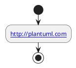
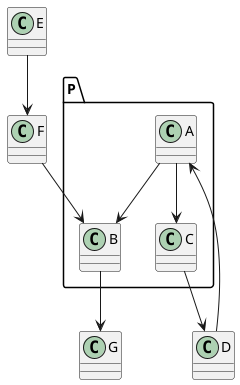
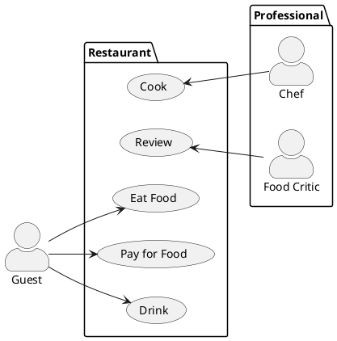
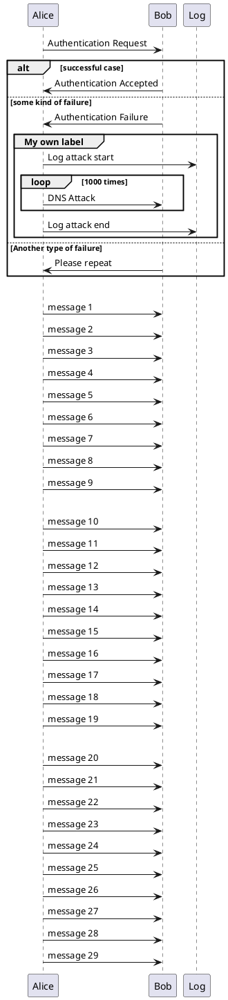

## Scalable Vector Graphics

[Scalable Vector Graphics (SVG) ](http://en.wikipedia.org/wiki/Scalable_Vector_Graphics) is a graphical format renowned for its scalability, ensuring that your diagrams maintain their quality at any zoom level, providing an optimal printing result. In this guide, we delve into how you can enable SVG generation with PlantUML, exploring various settings and directives that enhance your SVG output.


PlantUML offers multiple avenues to enable SVG generation, each catering to different environments. Here, we outline the methods available:

### Command Line
Utilize the `-tsvg` flag with the PlantUML command line to enable SVG generation. Learn more about this in our [command line guide](https://plantuml.com/en/command-line).

### Ant Task
Incorporate the `format="svg"` setting in your Ant task definition to facilitate SVG generation. Find detailed instructions in our [Ant task guide](https://plantuml.com/en/ant-task).

```
<target name="main">
  <plantuml dir="./src" format="svg" />
</target>
```

### Java

You can also generate SVG directly from Java. Discover how to set this up in [our Java API guide](api).


## Specific Skin Parameters for SVG

Enhance your SVG diagrams with specific skin parameters that allow you to customize various aspects of the output. Here we delve into some of the parameters you can use:

### svgLinkTarget

The `svgLinkTarget` setting allows you to modify the `target` attribute in the hyperlinks generated in the SVG output, thereby controlling how the links will open when clicked. 

Referencing [the HTML specification](https://www.w3.org/TR/html52/browsers.html#valid-browsing-context-names-or-keywords), you have the following options:
* `_blank`: Opens the link in a new window or tab
* `_parent`: Opens the link in the parent frame
* `_self`: Opens the link in the same frame where it was clicked (default setting)
* `_top`: Opens the link in the full body of the window

The default setting is `_top`, applied when the `svgLinkTarget` is left empty.



### pathHoverColor

Utilize the skinparam pathHoverColor setting to specify a color that will be applied to links when hovered over with the mouse pointer, enhancing user interaction with your diagrams.

```
@startuml
skinparam pathHoverColor green
class Foo2 [[http://www.yahoo.com/Foo2]] {
  +double[] x
  +double y
}
Foo2 --> Foo3
@enduml
```
*[Reference: [QA-5453](https://forum.plantuml.net/5453)]*

### svgDimensionStyle

If you prefer not to include the `style`, `width`, and `height` attributes in the SVG output header, set the `skinparam svgDimensionStyle` to `false`. This gives you cleaner output, focusing solely on the essential elements of your diagram.


```
@startuml
skinparam svgDimensionStyle false

component a {
}
component b {
}
a -(0- b
@enduml
```
*[Reference [QA-7334](https://forum.plantuml.net/7334)]*


## Specifying Pragma for SVGs

Leverage the `svgSize` pragma directive to define custom sizes for specific SVG elements in your PlantUML diagrams.

### Using the `svgSize` Pragma Directive

The `!pragma svgSize <U+hhhhh> XX` directive informs PlantUML to assume the size of the `<U+hhhhh>` element to be equivalent to the 'XX' value specified.

Here are different ways you can use this directive to obtain the ideal setting:

- ``!pragma svgSize <U+hhhhh> XX``
- ``!pragma svgSize <U+hhhhh> I``

#### Example Usage

Below is an example PlantUML code utilizing the `svgSize` directive:

```
@startuml
!pragma svgSize <U+1F610> XX

test: text <U+1F610>
test_size45: text <size:45><U+1F610>
@enduml
```

### Command-Line Options

You can specify the `svgSize` pragma using the `-P` option on the command-line. Remember to:

- Enclose the argument in quotes, especially when it contains spaces.
- Use this option multiple times in a single command, if necessary.

#### Example

```
java -jar plantuml.jar "-PsvgSize=<U+1F610> XX" "-PsvgSize=<U+1F611> I"
```

### References

- [Forum QA-12550](https://forum.plantuml.net/12550)
- [GitHub Issue 582](https://github.com/plantuml/plantuml/issues/582)


## Interactive SVG

### Reference

* [QA-13350](https://forum.plantuml.net/13350/add-interactive-functionality-usecase-diagrams-exported)

### On Class, Object, UseCase or Deployement diagram





### On Sequence diagram




