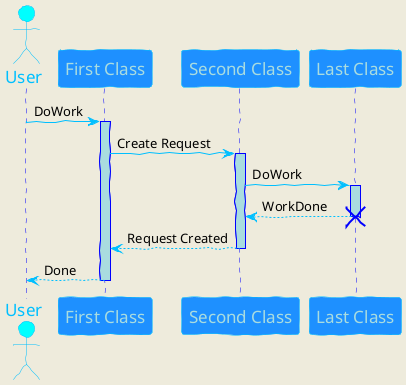

## PlantUML Text Encoding


## Introduction

PlantUML defines a standardized way to encode diagram text description to a simple string of characters that contains only digits, letters, underscore and minus character.
The goal of such an encoding is to facilitate communication of diagrams through URL (see [server](server)).
This encoding includes compression to keep encoded strings as short as possible.

The encoded metadata is stored in the generated PNG, so the diagram source can be extracted from the diagram itself! (see [server\#metadata](server#metadata)).


## Compression


[Deflate algorithm](http://en.wikipedia.org/wiki/DEFLATE) is used by default.

You can also use simple HEX encoding, see below. An initial ``~h`` is added to indicate this encoding.

**Principle**

For example, the following uml text description:

```
@startuml
Alice -> Bob: Authentication Request
Bob --> Alice: Authentication Response
@enduml
```

is [encoded as](http://www.plantuml.com/plantuml/uml/Syp9J4vLqBLJSCfFib9mB2t9ICqhoKnEBCdCprC8IYqiJIqkuGBAAUW2rO0LOr5LN92VLvpA1G00):

```
Syp9J4vLqBLJSCfFib9mB2t9ICqhoKnEBCdCprC8IYqiJIqkuGBAAUW2rO0LOr5LN92VLvpA1G00
```


To achieve such encoding, the text diagram is:

1. Encoded in UTF-8
1. Compressed using [Deflate](http://en.wikipedia.org/wiki/DEFLATE) algorithm
1. Reencoded in ASCII using a transformation *close* to [base64](http://en.wikipedia.org/wiki/Base64)


**Why not use Base64?**

The main reason is historic: this format was not created to be public at first. Now, it's too late to change it. However, the only difference is in character order.

Where in base64 the mapping array for values 0-63 is:
```
ABCDEFGHIJKLMNOPQRSTUVWXYZabcdefghijklmnopqrstuvwxyz0123456789+/
```

For PlantUML, the mapping array for values 0-63 is:
```
0123456789ABCDEFGHIJKLMNOPQRSTUVWXYZabcdefghijklmnopqrstuvwxyz-_
```


**Compression comparison **

The following diagram:



is compressed to [428-char string length using Deflate](http://www.plantuml.com/plantuml/uml/ZP4zRy8m48Pt_ueJdHawLMMe53iWLK9LLLHrFk8hM04xd9rI-kiR0u8a1CAG8SdpVja-DxP0nZNCCSiNx4ghbLivXeVnU2nJ9Vo9MABLMpOXa8N09OdQFq-Racn62RFR7WnIecAMx-Ig8Zl0B3YMZZNnFVZKV5UFfRfYteEs1oNFgKed7Oftv60oKw0DzpUgYrf9gTCBudxTnDdmXck2rtM1MUY7P-QFuF6f7-nRV3ZzLctSb7YDFPlUSQstgvwG_VG42_eL0kD7-FJ4eZXFWS74i0-WLkZz0D13RMVI96UKEQkxKTb4ftZDKmaHEy3mfP4qggxqot4UQveV3DJi8UflBQqSWMAAae-utuTE3zdma2qFTJDVrQKAXXVvKPawIq9NyUnshS7Du8lbnzh75ReowH-Gx7tYISRc--JEa_i7)


## Running

You can use ``-encodeurl`` or ``-decodeurl`` in the [command line](command-line) flags to encode or decode the text.

Implementations of the encoder in various languages:

* [Code in PHP](code-php)
* [Code in Javascript](code-javascript-synchronous) or [this](https://github.com/markushedvall/plantuml-encoder) (node.js or browser)
* [Code in Python](https://github.com/dougn/python-plantuml)
* [Code in Perl](https://metacpan.org/pod/UML::PlantUML::Encoder)
* [Code in Swift](https://blog.eidinger.info/plantuml-text-encoding-in-swift)


## Simple HEX format

If you find Deflate and Brotli too complex, you can try the HEX format.
In that case, you just have to encode each character in hexadecimal format.

For example :
```
@startuml
Alice->Bob : I am using hex
@enduml
```

will be turned into:
```
407374617274756d6c0a416c6963652d3e426f62203a204920616d207573696e67206865780a40656e64756d6c
```

To indicate the use of HEX format, you must add ``~h`` at the start of the data sent to PlantUML server.

[http://www.plantuml.com/plantuml/uml/~h4073...](http://www.plantuml.com/plantuml/uml/~h407374617274756d6c0a416c6963652d3e426f62203a204920616d207573696e67206865780a40656e64756d6c)

Since there is no compression here, the URL will become very long as the diagram grows.


